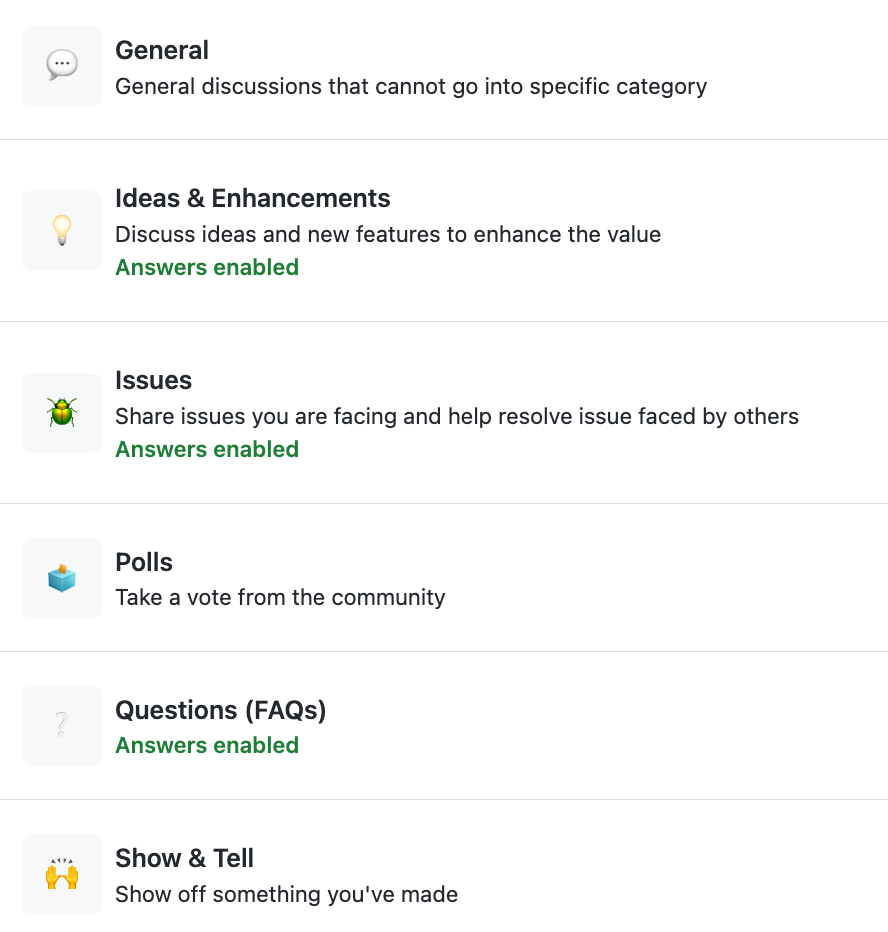

# Contribution Guidebook

**There are many ways to contribute to an open-source project, even if you are not a programmer or developer. Here are some suggestions on how you can start.**

1. Start small: If you are new to open source, start with small contributions such as reporting bugs, fixing documentation, or helping with translations.
2. Read the documentation: Read the project's documentation to understand how it works and what needs to be done.
3. Join the community: Join the project's community, ask questions, and get to know the developers and other contributors.
4. Contribute code: If you are a programmer, you can contribute code to the project. Start by looking for "good first issues" or "beginner-friendly" issues that are easy to fix.
5. Write documentation: If you are good at writing, you can help improve the project's documentation by writing tutorials, guides, or documentation.
6. Test and report bugs: Help the project by testing it and reporting bugs. This helps the developers identify and fix issues.

## How we work as a community

1.  **Engage with the community**&#x20;

    You can engage using Discussions for general questions, Ideas & Enhancement suggestions, Show & tell, etc.&#x20;

<figure><figcaption></figcaption></figure>

2. **Create an issue (or a ticket)**
   1. Provide sufficient details i.e. Title, Description, Screenshots, Videos, Environment, etc
   2. In the community repo by selecting the issue type (template) - Bug, Feature, Security Vulnerability
3. **Find issues to contribute**
   1. Look for issues/items tagged as “[Good first issue](https://github.com/Sunbird-RC/community/labels/Good%20first%20issue)”. If there are no good first issues, check out [the roadmap](https://github.com/orgs/Sunbird-RC/projects/16/views/1).
   2. From the Roadmap, look for [Priority items](https://github.com/orgs/Sunbird-RC/projects/16/views/6) that are not already in a Sprint
   3. Navigate using the components (labels) to find items relevant to your skillset/area of interest
   4. Comment on the ticket by tagging at least the current assignee and the reporter to get more clarity if needed or validate your approach to solving the issue. If you are clear on what needs to be done, you can go ahead & create a Pull Request to contribute code.&#x20;
4. **Processes and Rituals**
   1. Assume you have identified a ticket you wish to contribute
   2. Self-assign the ticket
   3. Ensure it has sufficient details
      1. Meaningful Title e.g. As a \<user persona>, I should be able to \<do something>, so that \<I benefit from it>
      2. Clear Description e.g. What is the problem?, Proposed Solution, Implementation Approach
         1. Acceptance criteria or Test cases
   4. Labeled appropriately to tag the Component, Priority, Issue Type
   5. Assigned to someone/you - only one person ideally
   6. Estimated time/days for completion, Target date
   7. Tagged to a Sprint
   8. Tag the Component owner/maintainer to review the implementation approach, code contribution
5. **Governance**
   1. Working Group
   2. Triage team
   3. Product council
   4. Architecture council
   5. Marking the issue as a duplicate
      1. Adding \[Duplicate] in the heading and closing the issue with the original issue link as a comment&#x20;
