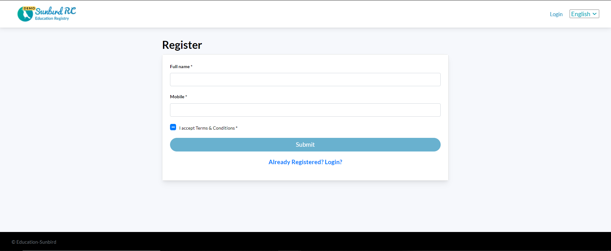

# VC Template

Create a VC template for the schema saved in previous step "Create Schema"

<figure><figcaption></figcaption></figure>

### Template

Once you have saved schema:

1. You can now add a verifiable credential template under each schema.
2. You can select existing template or create custom template

<figure><figcaption></figcaption></figure>

### Template for Attestation Workflow

If you have saved an Attestation Workflow, then you can create a VC template for the attestation workflow. For each attestation workflow, you can add a VC template.

<figure><figcaption></figcaption></figure>
