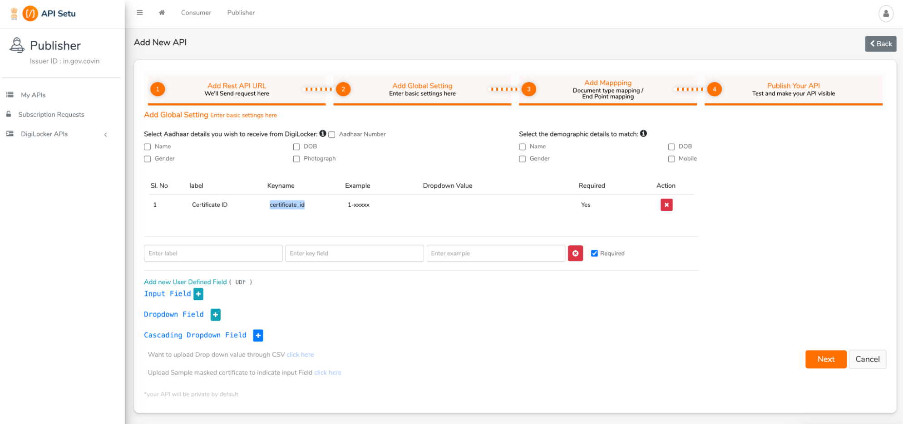

# Digilocker Integration

## Pre-requisites

* Partner account in digilocker. [https://partners.digitallocker.gov.in/](https://partners.digitallocker.gov.in/)
* Understand how digilocker issuer API works [https://partners.digitallocker.gov.in/assets/img/digital\_locker\_issuer\_api\_specification%20v1.10.pdf](https://partners.digitallocker.gov.in/assets/img/digital\_locker\_issuer\_api\_specification%20v1.10.pdf)

_**Note: Currently digilocker doesn't have a sandbox environment to test the integration. Testing needs to be performed on the production account. So be careful and conscious before making any changes in the partner portal.**_

## Onboarding Sunbird RC in Digilocker

* Log in to partner account
* Goto digilocker `Pull URI Request` section

<figure><figcaption></figcaption></figure>

* Click on `+ Add`
* Add the details as shown below.
* `Search API Id`: You need to give a unique name to your API Id. This id will be passed to your backend for retrieving the VC
* `Search API Description:` You can update this as per your business functionality.
* `API Key:` You need to create a new unique and secure API key. This key will be used to generate the HMAC of the request body sent by digilocker. This key needs to be kept secure and confidential.
* `Rest API Service URL:` You need to specify the SunbirdRC URL to access the VC. Ex: \`[https://\<host>/digilocker/v1/digilocker/pullUriRequest](broken-reference/)\`
* And click on `Next`

<figure><figcaption></figcaption></figure>

* In the next section, you can define what user parameters you would need to be sent to backend for accessing the VC. Here you can select a few existing user profile parameters like Aadhaar / demographic details. Or else you can also define custom parameters as shown below. `Ex: Certificate ID.` These parameters will be used as search parameters to fetch the VC for the user. In the below section, the steps to configure the search parameters are defined.
* Click on \`Next

<figure><figcaption></figcaption></figure>

* Add the type of document which you are fetching. This will be displayed in digilocker
* Click on `Update`

<figure><figcaption></figcaption></figure>

* Now you can test your configuration. Enter the details of the parameters that are displayed and click on `Test Service.` If all the details were configured correctly, you will be displayed with the VC certificate in the below section.
* Once all the configuration is tested, this can be published. Only if it is published it will be displayed on the Digilocker portal for users to pull their credentials.

<figure><figcaption></figcaption></figure>

## Configure SunbirdRC to access VC from Digilocker

You can fetch the credentials generated by Sunbird RC in Digilocker once you have configured the partner account.

Configurations required for the service to pull credentials are mentioned [here](configuration.md#digilocker-certificate-api)

Apart from this, you will also require a JSON File which has the following information. The below JSON file is used to map configuration for the document type configured in digilocker

Following is the sample JSON file.

```json
{
    "docType": {
        "schema": "Schema",
        "template": "html",
        "searchFilter": {
            "filters": {
                "osid": {
                    "eq": "{{.certificate_id}}"
                }
            }
        }
    }
}
```

**Definitions:**

* _**docType:**_ This value refers to the document type that is configured in Digilocker
* _**schema:**_ This refers to the schema which the VC needs to be fetched from.
* _**template:**_ This refers to the template key that needs to be used for rendering the presentation layer for the VC.
* _**searchFilter:**_ This defines the search filters that need to be executed on RC to identify the VC. We can mention the parameters that are configured on `Add New API` page of Digilocker. Sunbird RC uses this search filter to search for the credential in the registry and if present, it fetches the certificate in pdf format and creates a response in XML format to be sent to digilocker to store the certificate

Example JSON file:

`The below sample JSON is configured to fetch the` [`Pre Matric Scholarship`](https://github.com/Sunbird-RC/demo-education-registry/blob/federated\_edu\_registry/sample\_schemas/PreMatricScholarship.json) `Credential`

```json
{
    "SACER": {
        "schema": "PreMatricScholarship",
        "template": "html",
        "searchFilter": {
            "filters": {
                "osid": {
                    "eq": "{{.certificate_id}}"
                }
            }
        }
    }
}
```
