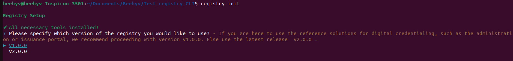
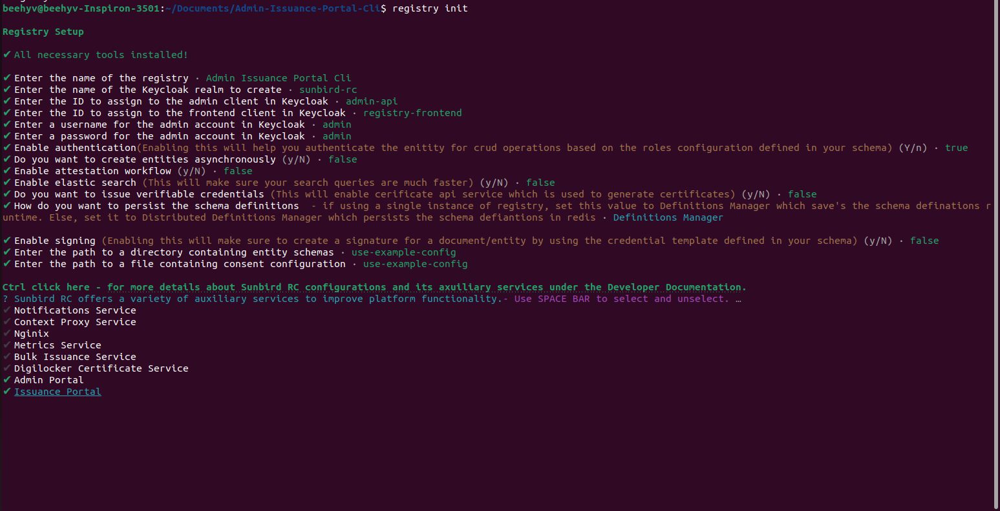
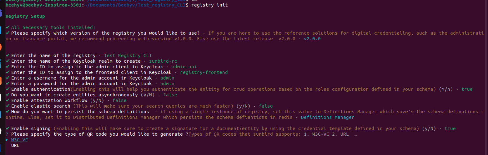
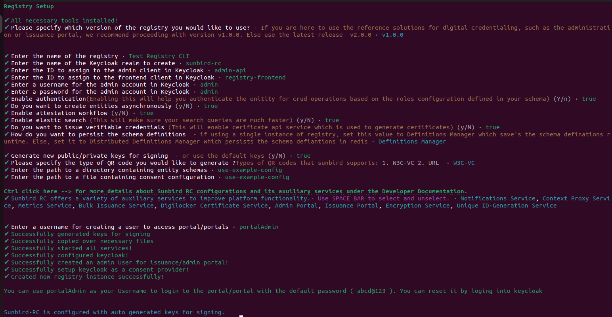
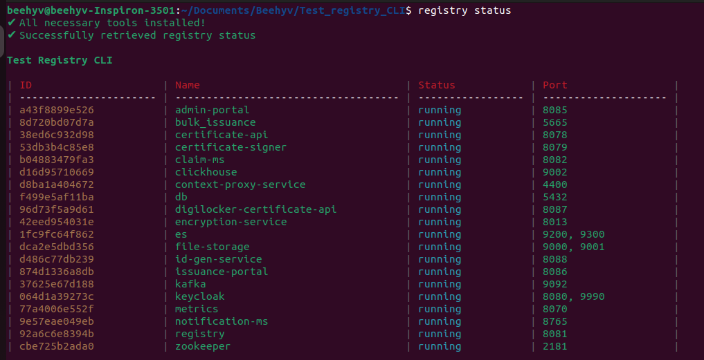
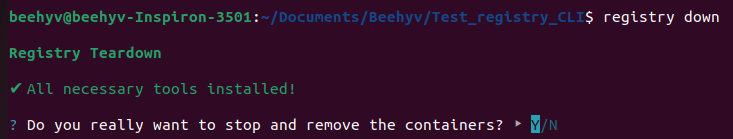

# Setup A Registry Instance

#### Initialize registry

Now that you have the Registry CLI installed, we can create a new instance of a registry!

Run the following command in a directory where you wish to setup the registry. For this example, we will use `~/Registries/example/`. (`~` is short form for the user's home directory).

```bash
# Create and move into the ~/Registries/example directory
mkdir -p ~/Registries/example
cd ~/Registries/example
# Create a registry instance
registry init
```

This will present you with a set of questions to setup the registry. For the purpose of this getting started guide, you can hit enter and use the default values for the registry. Please follow the references below

* _**Registry Version**_

<figure><figcaption><p>registry version</p></figcaption></figure>

* _**Auxiliary Services**_

The registry provides a set of auxiliary services that you can use in addition to the core registry. To select or deselect any of these services, use the _**SPACE BAR**_.

Reference solutions for digital credentialing, including administration or issuance portals, are available in Auxiliary services.

<figure><figcaption></figcaption></figure>

* _**Type of QR**_

When VC Issuance is enabled, you'll be prompted to choose the type of QR code to generate on your certificates.

<figure><figcaption></figcaption></figure>

<figure><figcaption><p>registry init - v1.0.0 </p></figcaption></figure>

#### Registry Status

Once the registry init is successfully initialized, the status of all the services can be checked using

```bash
registry status
```

The above command should return the status of all the services, like below

<figure><figcaption></figcaption></figure>

Make sure that the status of all the services is in the `running` state. If any of the services are in `exited` status you can restart only that particular service.

```bash
docker-compose restart <service-name>
```

To restart the registry use the below command

```sh
SCHEMA_DIR=config/schemas docker-compos up -d --force-recreate --no-deps registry
```

#### Registry Down

To stop the running services, you can use the below command

```
registry down
```

<figure><figcaption></figcaption></figure>
