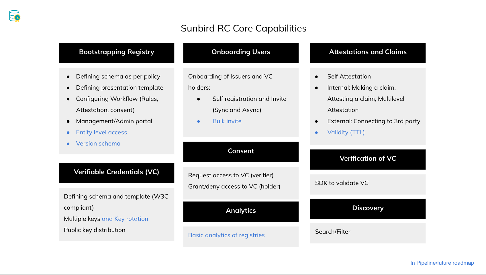

# Core Capabilities

<figure><figcaption></figcaption></figure>

## Bootstrapping Registry

* Defining Schema as per Policy
* Defining presentation template
* Configuring workflow (Rules, Attestation, Consent)
* Management Admin Portal

## Veriable Credentials (VC)

## Onboarding Users

## Attestation & Claims

## Consent

## Verification of VC

## Analytics

## Discovery
