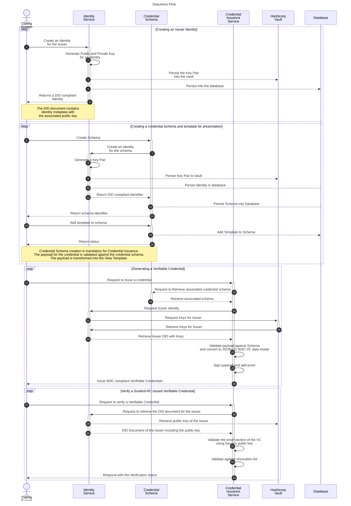

# High-Level Architecture

Sunbird-RC's credentialling service is an amalgamation of three microservices.

* **Identity Microservice:** This service is the central lynchpin to maintain identities across the system. All identities in Sunbird-RC are DID-compliant and are web-resolvable. The other microservices (Credential Schema Service and Credential Service) depend on this for generating any identity.
* **Credential Schema Microservice:** This service stores the schema of the Verifiable Credential along with the associated view template.
* **Credential Issuance Microservice:** This is the core issuance service. This service is called with the payload, which is then transformed into a W3C-compliant Verifiable Credential in JSON-LD format.  The payload is then signed using the private key which was generated as part of the original Issuer creation.&#x20;

### Architecture Diagram

### Sequence Diagram

