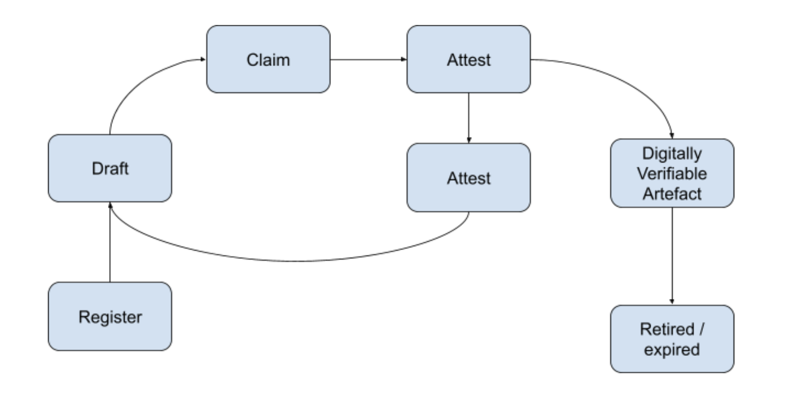
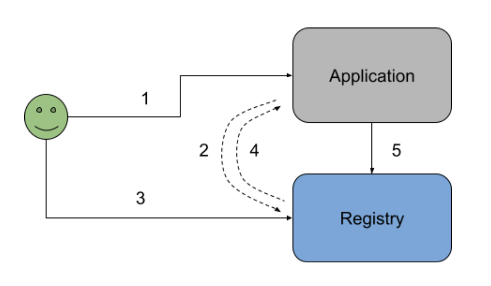

# Technical Specification Draft

_**This is an early draft of the specification. You can give your feedback to improve the same via the**_ [_**Discussions area**_](https://github.com/Sunbird-RC/community/discussions/categories/sunbird-rc-technical-specification-feedback)_**.**_

## **Introduction**

All digital platforms require master data and actors (person/entity/thing) data related to that system to be maintained for identification, validation, etc. For example, a property tax system needs to maintain master data about properties, land boundaries, tax codes, tax payers, inspection officers, etc. in a structured and validated fashion so as to help manage the property tax transaction in a seamless manner. As the world becomes data rich, it is essential that various data about people, entities, geographies, resources, assets, etc. are made available in electronic registries with Open APIs for other applications to seamlessly validate and use attested and authenticated data. This is even more critical when it comes to people and entities where various claims can be electronically validated against such registries via open APIs avoiding paper based validations, thus increasing trust while decreasing cost of validation.

## **Core principles**

- LIVE: Due to its changing nature, such data often goes stale (not up-to-date), thus increasing the cost of collection and maintenance. For example, information about schools and teachers, their contact details, etc. get outdated, forcing departments to redo data collection every few years, and digitise, through time consuming processes.
- REUSEABLE: Even if such data is maintained by one system, it is not available to be reused by other systems forcing every department needing such data to repeat data collection and maintenance.
- TRUSTWORTHY: When data is exchanged between systems, trust of that data is established by ensuring the entire record itself is digitally signed and the fact that registry record comes with attestations along with the data. For example, a list of schools downloaded as a CSV file from a portal cannot be trusted by other systems since there is no guarantee that it is authentic and has not been edited subsequently.

## **Terminology**

| Data                          | Electronic data of any type. It could be simple data or composite data.                                                                                                                                                                                                                                                                                                                   |
| ----------------------------- | ----------------------------------------------------------------------------------------------------------------------------------------------------------------------------------------------------------------------------------------------------------------------------------------------------------------------------------------------------------------------------------------- |
| Database                      | A software system that stores and manages data.                                                                                                                                                                                                                                                                                                                                           |
| Schema                        | Machine readable definition of data.                                                                                                                                                                                                                                                                                                                                                      |
| Actor (Subject)               | A person, entity, or a thing who/which has been identified.                                                                                                                                                                                                                                                                                                                               |
| Transaction/ Interaction Data | Data representing details of an interaction/transaction that was done among one or more actors within a system.                                                                                                                                                                                                                                                                           |
| SoR (System of Record)        | A software system that is the primary system to enable a specific set of transactions/interactions through a set of workflows and user interfaces. Identities of actors participating in these transactions/interactions maybe linked to a registry.                                                                                                                                      |
| Registration                  | Act of registering/enrolling the actor into a system                                                                                                                                                                                                                                                                                                                                      |
| Claim                         | A statement that is made by an actor which can be verified.                                                                                                                                                                                                                                                                                                                               |
| Attestation                   | An act of verifying and authorizing specific data in a digitally signed fashion by an authorized individual/entity (whose identities are typically linked to some other registries).                                                                                                                                                                                                      |
| Discovery                     | An act of finding specific entries in a registry through a search/find mechanism.                                                                                                                                                                                                                                                                                                         |
| Assertion                     | An act of verifying a claim.                                                                                                                                                                                                                                                                                                                                                              |
| Consent                       | Approval of an actor given to another person/system to access the data of that actor for purposes of transaction/interaction.                                                                                                                                                                                                                                                             |
| Credential                    | Digitally represented verifiable artifacts containing a qualification, achievement, milestone, fact, etc issued to an actor for them to be able to make claims.                                                                                                                                                                                                                           |
| Registry                      | An Electronic Registry is a system, acting as a single source of truth that houses a set of common attributes of the actor in a trustable (attested) and non-repudiable (audited) fashion, made available in the control of the actor enabling actors to authenticate themselves and make claims about them with their consent which can be electronically verified by 3rd party systems. |
| Information Provider          | An authorized entity or a person who manages a SoR for enabling specific transactions/interactions among various actors. This entity using their systems of record then provides verifiable (digitally) credentials, documents, certificates, and transaction/interaction data etc. back to actors.                                                                                       |
| Information Users             | An entity that is accessing credentials/data of an actor with necessary consent of the actor for making assertions and providing various services/products.                                                                                                                                                                                                                               |

## **Workflow**



## **Schema**

All registries have attributes pertaining to the entity or the fact in question either person or things. Schema defines the structure and constraints of the entity, Sunbird RC uses standard JSON-LD based schema.

In the example given below Place is Concept that registry is storing supporting name, city, addressRegion (state) and country.

#### Example:

```
{
 "$schema": "http://json-schema.org/draft-07/schema",
 "type": "object",
 "properties": {
   "Place": {
     "$ref": "#/definitions/Place"
   }
 },
 "required": [
   "Place"
 ],
 "title": "Place",
 "definitions": {
   "Place": {
     "$id": "#/properties/Place",
     "type": "object",
     "title": "The Place Schema",
     "required": [
       "name",
       "city",
       "addressRegion",
       "country"
     ],
     "properties": {
       "name": {
         "type": "string"
       },
       "city": {
         "type": "string"
       },
       "addressLocality": {
         "type": "string"
       },
       "addressRegion": {
         "type": "string"
       },
       "country": {
         "type": "string"
       },
       "postalCode": {
         "type": "string"
       },
       "contact": {
         "type": "string"
       }
     }
   }
 }}
```

## Configuration

In addition to JSON LD specific data types Sunbird RC supports various extension configurations under `\_osConfig`. Access, indexing, primary key etc are configurable using schema configuration.

#### Entity and Properties

#### Property data types and restrictions

Supported types:

String - Unicode text, additional regular expressions restrictions can be applied.

Enum - restricted list of values

Number - numeric data

#### List of attributes

Collection of data values are also supported as multiple data value might represent the entity property for example subjects taught : `["english","science, "mathematics"]`

### Visibility scope:

3 types of visibility on attributes.

1. Public
2. Private (privateFields)
3. Internal

Public data attributes are available in discovery by default any sort of permission / authorization is not needed by default.

Private attributes can be accessed by the owner by default, with consent 3rd party can access the data field.

Internal fields are system fields that only serve internal functionalities, these can never be accessed by any actors in the system.

#### Primary Keys for Entities

Primary keys from domain space will help enforce uniqueness of information and make it easily accessible. “uniqueIndexFields” can be used to configure the same.

Example:

```
"uniqueIndexFields": [ "identityValue", ... ]
```

### Index field set

Indexes can help in faster access to information, based on usage context index fields can be configured. Example:

`"indexFields": ["phoneNumber", ... ],`

### Validation Extensions

JSON LD schema allows defining basic type constraints like numeric type, text or list of items etc. Also it allows a list of possible values for given attributes (enum) and regular expressions based constraints for the value.

### Schema access api:

OpenSaberRC supports following apis for accessing schema:

```
GET /api/docs/{entityName}.json
```

Swagger document is accessible at

```
GET /api/docs/swagger.json
```

## Attestation

### Configuration

Attestation on given set of fields is configurable with schema configuration. Below is the example for attestation requirement using DSL.

Example:

```
 "attestationPolicies": [
 {
     "property": "experience/\[\]",
     "paths": [ "experience" ],
     "attestorEntity": "Institute",
     "conditions": "\(ATTESTOR\#$.instituteName\#.contains\(REQUESTER\#$.institute\#\)\)"
 },
  ...
 ]
```

### Attestation API

#### Attestation Types

Since there will be mixed attestation requirements which need human verification and in some cases attestations can be completely digital, To begin with registries can allow both manual and automatic attestation types. A teacher rewarding and attesting the grades can be manual activity, identity claim can be attested digitally by identity provider like Aadhaar.

Manual Attestation

Manual attestation may need workflow, by default registry supports raising claim to pre-configured attestation requirement. The claim will be routed to appropriate authority / role based on the configuration. Once the claim gets approved / rejected it will show the status of respective fields in the claim as verified / invalid respectively.

Attestor configuration is controlled with “attestorEntity” configuration.

Automated attestation

Digital registries can inter-operate sharing the trusted claims and information among themselves. For doing so claim can be routed to automated registry verifier which will proxy for another registry and take care of verification and attestation. Such attestation can be time bound or one time attestation.

Example: Identity registry can be used to prove the identity of a subject without manual verification. Mobile OTP based consent flow can verify the identity and mark subjects name as verified. Eventually certificates issued by educational institutions can also get verified digitally.

```
POST /api/v1/{entityName}/{entityId}/attest/{propertyID}
{
  "action":"GRANT_CLAIM"
  ...
}
```

#### Custom extensions

Attestation workflow might need custom stages and transition rules based on the usecase. Attestation is extensible to add or customize these workflows and add custom rules based on the need.

## Enrolment / Signup

### Sign up

Enrolment/Signup API supports use cases related to self signup or bulk invites to register in the registry. One of the principles of registry is to avoid stale data loading from databases and give control to subjects in participating in registration and managing their data (Rather than someone else managing it for them).

```
POST /api/v1/{entityName}/invite
{
"name”:"Suresh",
"email":"suresh@example.com"
}
```

### Update information

```
PATCH /api/v1/{entityName}/{entityId}
{
  "fieldPaths":["/name"]
}
```

## Discovery

### Search API

```
POST /api/v1/search
{
  "email":"suresh@example.com"
}
```

### Directory

Example pincode lookup

```
POST /api/v1/search { "state":"Karnataka" }
```

## Consent API

### Authentication flow



### Request scopes and sharing attributes

```
GET /partner/api/v1/{entityName}
```

## Use Cases

- Building a Blood donor registry
- Building simple pincode directory service
- Education registry
- Immunization
- Authentication and consent usage in learning application

## **Open for feedback**

_**This is an early draft of the specification. You can give your feedback to improve the same via the**_ [_**Discussions area**_](https://github.com/Sunbird-RC/community/discussions/categories/sunbird-rc-technical-specification-feedback)_**.**_
