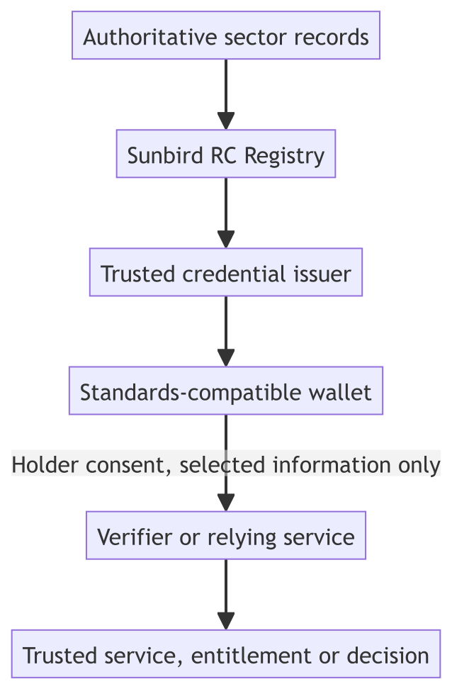

# Applications of Sunbird RC

Three sectors, one foundation. Each application below is a complete journey: an
authoritative registry holds the record, an issuer derives a credential from it,
a wallet on a real phone stores it, and a relying party verifies it and applies
its own published rule.

They are deliberately different from one another. Age verification uses **one**
credential and discloses a single yes/no fact. Rural credit correlates **two**
credentials from two independent registries. Education reuses **three**
credentials for **two different decisions** that reach different answers. Read in
that order, they show the same platform capability scaling from the simplest case
to a genuinely hard one.


The complete source, configuration, tests and evidence for all three


## The applications

| Application | Credentials | The question answered | The interesting part |
| ----------- | ----------- | --------------------- | -------------------- |
| [Age verification](age-verification.md) | 1 | Is this person over 18? | The date of birth is never disclosed — only the derived fact |
| [Agriculture and rural credit](agriculture-rural-credit.md) | 2 | Is this farmer eligible, and for how much? | Two registries stay independent; the bank never gets a shared database |
| [Education and employment](education-employment.md) | 3 | Can this learner apply, and can they interview? | The same three credentials give two verifiers two different answers |

## The common pattern

Every application follows the same six steps. Only the domain, the policy and the
number of credentials change.

1. Model authoritative records as Registry schemas.
2. Connect authenticated users to their own records.
3. Issue verifiable credentials derived from those records.
4. Store them in a standards-compatible wallet the holder controls.
5. Request and present **only** the information a stated purpose requires.
6. Verify trust and integrity **before** applying any business rule.

## Capability map

What each application exercises. This describes these examples; it is not a
boundary on what Sunbird RC can be configured to do.

| Capability | Age verification | Rural credit | Education and employment |
| ---------- | ---------------- | ------------ | ------------------------ |
| Authoritative records | Citizen | Farmer and land | Learner, school, college, university |
| Registry schemas | One citizen model | Separate farmer and land models | Four separate education models |
| Credential issuers | One identity authority | Two registries | Three institutions |
| Credentials used together | One | Two | Three |
| Wallet-driven issuance | Yes | Yes | Yes |
| Selective disclosure | A single derived condition | Ownership, crop and area facts | Qualification and result facts |
| Cross-credential correlation | Not required | Farmer ID across two credentials | Learner ID across three credentials |
| Verifier applications | Web and mobile age check | Bank farm-credit application | University admissions and an employer |
| Example decision | Condition satisfied | Eligibility and a loan ceiling | Admission-pool or interview eligibility |

## What Sunbird RC contributes, and what an ecosystem must add

Sunbird RC provides the mechanism: model records, configure issuers, derive
credentials from authoritative data, and support standards-based credential
exchange.

Each ecosystem still has to decide, deliberately:

* which organisations are authoritative, and for which records;
* record identifiers and the mappings that are permitted between them;
* credential issuers, signing identities and trust governance;
* the claims each credential carries, and the minimum each verifier may request;
* wallet and protocol-profile compatibility;
* each verifier's purpose, policy and user-facing outcome; and
* production privacy, security, revocation and audit controls.

## What these examples run on

The registry, credential, identity and schema services are released Sunbird RC
**v2.1.0**, unmodified.

One capability is not yet in a release. All three applications issue
**wallet-driven**: the holder signs in and the wallet fetches the credential
straight from the issuer, with no QR code and no issuer web page. That uses the
OpenID4VCI `authorization_code` grant with an external authorization server,
which released `v2.1.0` does not yet support — it offers the pre-authorised
grant. The demonstration therefore runs `oid4vc-service` with that capability
added, and the change has been proposed upstream:


feat(oid4vc-service): Keycloak-as-authorization-server issuance, and issuer authorization on the credential endpoint


It is an opt-in addition: with no authorization server configured the service
behaves exactly as `v2.1.0` does, and existing pre-authorised deployments are
unaffected. Everything else on these pages runs on the released images.

## About the data in these examples


Captured test runs and acceptance evidence for all three applications


Every citizen, farmer, learner, institution, identifier and result in these
applications is **synthetic**. No real personal data is used anywhere. The
records, thresholds and lending rates are illustrative and are not policy
recommendations.

Each application also states plainly what it does **not** implement. Verifying a
credential is not the same as running an admissions process, a lending business
or an age-restricted service, and the pages are careful about that line.
