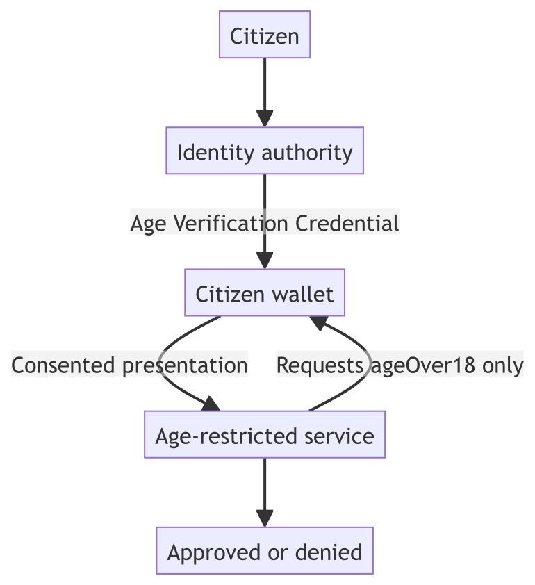

# Age verification

## Problem statement

Age-restricted services routinely ask for a document that proves far more than
age. A driving licence or national ID card shown at a counter, or uploaded to a
website, reveals a date of birth, a full name, an address, a photograph and an
identity number — when the only thing the service is entitled to know is whether
the person is old enough.

That over-collection is not malice; it is the only option a paper or scanned
document offers. The document cannot answer a narrower question than the one it
was printed to answer. So every age check becomes an identity disclosure, every
service becomes a custodian of personal data it did not want, and the citizen
loses a little privacy each time.

The real requirement is narrow: **a trustworthy yes or no to a single question**,
reusable across services, that the citizen carries and consents to share.

## Ecosystem participants, coverage and boundaries

| Participant | Responsibility | Coverage here | Remaining for production |
| ----------- | -------------- | ------------- | ------------------------ |
| Citizen | Obtains and controls their own credential | **Demonstrated** — synthetic citizens store and present it | Enrolment, corrections, recovery, accessibility, support |
| Identity authority | Holds the authoritative record and issues the credential | **Represented and issued** — a synthetic registry and issuer | Integration with a real population register and authorised issuance |
| Identity provider | Authenticates the citizen for issuance | **Represented** — Keycloak authenticates synthetic accounts | National or institutional identity integration, assurance levels |
| Wallet provider | Stores the credential, discloses by purpose | **Demonstrated** — a standards-compatible wallet on a real device | Production assurance, recovery, device security |
| Age-restricted service | Verifies and decides | **Demonstrated** — web and mobile verifiers applying a published rule | Commercial rules, logging, appeals, accessibility |

## The application

The identity authority holds a citizen record containing a date of birth. It does
**not** issue that date of birth. Instead it derives a condition from it and
issues a credential asserting only the derived fact.

The citizen authenticates once, and the wallet fetches the credential directly —
no QR code, no issuer web page. From then on the credential lives on the phone
and can be presented as often as needed, to any service that trusts the issuer.

When an age-restricted service needs a check, it requests exactly one claim. The
citizen sees who is asking and what they want, and consents. The verifier checks
the signature, the issuer, the holder binding, the nonce and the audience — and
only then applies its rule.



## How Sunbird RC enables it

### Registry — the source record

An `AgeCitizen` entity holds the synthetic citizen record, including
`dateOfBirth`. This is the authoritative source, and it stays with the identity
authority.

### Credential — derived, not copied

The issuer computes the condition at issuance time and puts **only the result**
into the credential:

| Credential | Claim | Example value |
| ---------- | ----- | ------------- |
| Age Verification Credential | `ageOver18` | `true` |

The date of birth never leaves the registry. This is the heart of the example: a
credential is not a photocopy of a record, it is a purpose-shaped assertion
derived from one.

### Verification — before any decision

The verifier requests `ageOver18` and nothing else, then runs the full check
sequence — issuer trust against an allowlist, signature, holder binding, nonce,
audience, expiry, replay and disclosure — **before** the business rule is
applied. A credential that fails any check produces a verification failure, not a
denial: "we could not verify this" and "this person is under 18" are different
answers and are reported differently.

## What the service learns

| Requested and disclosed | Never requested |
| ----------------------- | --------------- |
| `ageOver18` | Date of birth, name, gender, district, state, citizen identifier, holder identifier |

A refusal is also a valid outcome. If the citizen declines, the service is told
**no data was shared** — reported as a refusal, never as a verification error or
a system fault.

## Demonstration policy

* The credential must be issued by an issuer on the verifier's trust allowlist.
* Every verification check must pass before the rule is applied.
* The rule itself is a single condition: `ageOver18` must be true.

Eligibility means the service may proceed. It is not an identity assertion and
carries no other entitlement.

## Watch the demonstration

<!-- VIDEO SLOT - not yet published.
     When the clip is live on the Sunbird YouTube channel, replace this
     whole comment with the embed below, keeping the caption line.
     Source film: RC_video/New_Flow/27-08-2016/Age-Verification-Showcase-27Aug.mp4
     Suggested title: Sunbird RC — Age verification: prove you are over 18 without revealing your date of birth

     
     Age verification: one credential, one disclosed fact, and a date of birth that never leaves the registry
     
-->


Acceptance evidence, captured test runs and the recorded walkthrough


The recording covers wallet-driven issuance, a cross-device check where a laptop
shows a QR code and the phone scans it, a same-device check from an installed
verifier app, and a refusal — with approved, denied and "no data shared" all on
screen.

## Try it



```bash
cd deploy && docker compose up -d
../scripts/bootstrap.sh            # mints DIDs, publishes schemas
../scripts/seed-age-citizens.sh    # synthetic citizens
cd .. && npm run test:unit && npm run test:e2e
```

The suite includes the negative cases that matter: a tampered credential, an
untrusted issuer, a replayed presentation, a mismatched audience and an
unapproved signature algorithm.

## How to adapt this pattern

1. Identify the authority that holds the underlying record.
2. Decide which **condition** the credential asserts, rather than which record
   field it copies. Prefer `over18` to a date of birth.
3. Model the registry schema for the source record.
4. Configure the issuer, its signing identity and the trust list verifiers use.
5. Define the minimum disclosure for each verifying service separately.
6. Keep the service's own commercial rules outside credential verification.
7. Add production revocation, expiry, corrections, privacy and audit controls.
8. Test forged issuers, tampering, replay and refusal — not only the happy path.

## Boundaries

This is a reference application, not a production age-assurance system. The
citizens and their records are synthetic. It does not implement identity proofing,
age-estimation fallbacks for citizens without a credential, commercial
integration, or the regulatory reporting an age-restricted operator is likely to
need.
