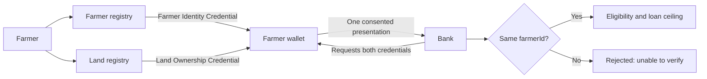

# Agriculture and rural credit

## Problem statement

A smallholder applying for crop credit is usually asked to prove two separate
things held by two separate authorities: that they are a registered farmer, and
that they hold and cultivate land. The farmer registry knows the first. The land
registry knows the second. Neither knows the other's records, and neither exists
to serve banks.

So the burden falls on the farmer. They collect certificates, extracts and
attestations, carry them to a branch, and wait while a clerk decides whether the
documents are genuine and whether they describe the same person. Verification
means phone calls, letters, or a bank official trusting a stamp.

The usual technical answer — give the bank direct access to both registries — is
worse than the problem. It requires two authorities to expose their records to a
commercial third party, creates a standing data-sharing relationship neither
wanted, and still does not prove the two records describe the same person.

What is actually needed: **two independent authorities each attest what they
know, the farmer carries both attestations, and the bank checks that they belong
to the same person** — without any of them being connected to each other.

## Ecosystem participants, coverage and boundaries

| Participant | Responsibility | Coverage here | Remaining for production |
| ----------- | -------------- | ------------- | ------------------------ |
| Farmer | Obtains and controls both credentials | **Demonstrated** — synthetic farmers hold and present both | Enrolment, corrections, recovery, assisted access, low-connectivity support |
| Farmer registry | Maintains registration status, issues its credential | **Represented and issued** — an independent synthetic registry and issuer | Integration with state farmer registries, authorised issuance |
| Land registry | Maintains ownership, crop and area records | **Represented and issued** — a second, separate registry and issuer | Integration with land records, survey and mutation processes |
| Identity provider | Authenticates the farmer for issuance | **Represented** — Keycloak authenticates synthetic accounts | National or state identity integration |
| Wallet provider | Stores both credentials, discloses by purpose | **Demonstrated** — the same wallet serves both issuers | Production assurance, recovery, device security |
| Bank | Verifies both and applies a lending rule | **Demonstrated** — verifies, correlates, and applies a published rate table | Underwriting, KYC, disbursement, collections, regulatory reporting |

## The application

Two registries issue independently. The farmer registry issues a **Farmer
Identity Credential** asserting registration. The land registry issues a **Land
Ownership Credential** describing ownership, crop and cultivated area. Neither
registry consults the other; neither knows the credential the other issued.

The farmer authenticates and the wallet fetches each credential directly from its
own issuer. Both then sit on the phone, bound to the same holder key.

When the farmer applies for credit, the bank requests both in **one**
presentation. The wallet asks for consent once, and returns both — each with its
own key binding proving the same holder presented them.

The bank then does what neither registry can do alone: it checks that the
`farmerId` in the farmer credential and the `farmerId` in the land credential are
**the same**. That correlation is the point of the design. Two authorities
asserting facts about the same identifier, verified by a third party that trusts
neither with a database connection.



## How Sunbird RC enables it

### Two registries, deliberately separate

`FarmerRecord` and `LandRecord` are distinct entities with distinct schemas, each
authoritative for its own facts. Keeping them separate is what makes the
correlation check meaningful — a single combined registry would make the check
vacuous.

### Two issuers, two signing identities

Each registry runs its own issuer instance with its own DID. A verifier can tell
which authority asserted which fact, and can trust them independently. Each issuer
is also restricted to issuing only the credential type it authored, so one cannot
mint the other's.

### The credentials

| Credential | Issuer | Claims requested by the bank |
| ---------- | ------ | ---------------------------- |
| Farmer Identity Credential | Farmer registry | `farmerId`, `registeredFarmer` |
| Land Ownership Credential | Land registry | `farmerId`, `ownershipStatus`, `cropType`, `cultivatedAreaAcres` |

Illustrative values, all synthetic: `farmerId: FRM-KA-0041`,
`registeredFarmer: true`, `ownershipStatus: ACTIVE`, `cropType: WHEAT`,
`cultivatedAreaAcres: 3.5`.

### Correlation and multi-credential verification

The bank verifies both credentials, then requires that the `farmerId` match
across them. A mismatch is a **verification failure**, not a lending decision —
the applicant is not told they are ineligible, they are told the evidence could
not be verified.

## Demonstration policy

The lending rule is version-controlled configuration, not code, so a reader can
see exactly what produced a number:

| Crop | Rate per acre (₹) |
| ---- | ----------------- |
| Sugarcane | 50,000 |
| Cotton | 45,000 |
| Wheat | 40,000 |
| Paddy | 30,000 |
| Maize | 25,000 |

* The farmer must be registered (`registeredFarmer` true).
* Land ownership must be `ACTIVE`.
* The crop must be in the rate table.
* The offer is rate × cultivated acres, subject to a per-acre ceiling of ₹50,000.

An eligible result is an **indicative credit assessment**. It is not an approved
loan, a disbursement or a commitment, and the application says so on screen.

## What the bank learns

| Disclosed | Never requested |
| --------- | --------------- |
| `farmerId`, `registeredFarmer`, `ownershipStatus`, `cropType`, `cultivatedAreaAcres` | Name, address, national identifier, contact details, bank details, total land holding, other plots, other crops |

## Watch the demonstration


Acceptance evidence, captured test runs and the recorded walkthrough


The recording covers issuance from both registries into one wallet, a
two-credential presentation with a single consent, an eligible decision with the
loan ceiling shown, an ineligible outcome, and a rejection where the two
credentials name **different** farmers.

## Try it

```bash
cd deploy && docker compose up -d
../scripts/bootstrap.sh          # mints DIDs, publishes both schemas
../scripts/seed-agriculture.sh   # synthetic farmers and land records
cd .. && npm run test:unit && npm run test:e2e
```

The suite includes the case that matters most here: two genuine, correctly
signed credentials that describe **different** farmers, which must be refused
rather than scored.

## How to adapt this pattern

1. Identify the authorities and keep their records separate.
2. Choose the correlation identifier deliberately — it must be meaningful to both
   authorities without becoming a shared national identifier disclosed to
   verifiers.
3. Model each registry schema independently.
4. Give each issuer its own signing identity and trust entry.
5. Define the minimum disclosure for the verifier's specific purpose.
6. Put the lending rule in version-controlled configuration, so a decision can be
   explained and audited.
7. Treat correlation failure as a verification outcome, never as a business
   rejection.
8. Add production revocation, expiry, grievance and audit controls.

## Boundaries

This demonstrates credential issuance, multi-credential presentation and
verification. It is **not** a lending platform. It does not implement
underwriting, KYC, credit history, disbursement, collections, insurance,
subsidies or regulatory reporting, and the rate table is illustrative rather than
a recommendation.
