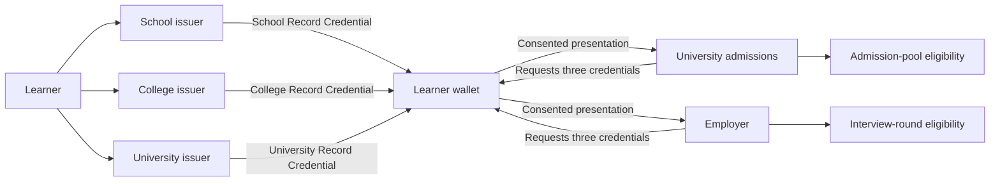

# Education and employment

## Problem statement

Education records accumulate over years, held by institutions that never
coordinate. A learner completes school under one authority, a diploma at a
college, a degree at a university. Later, applying for a postgraduate place or a
job, they must assemble that history and prove all of it at once.

Today that means paper certificates, scanned copies, institution portals and
manual verification. The receiving organisation has to determine whether each
document is genuine, whether the issuing institution is recognised, whether the
records all describe the **same** applicant, and whether the qualifications meet
its rule. Verification means emails, phone calls, or separate integrations with
every institution.

It also drives over-collection. A university or employer that needs only
completion status, qualification and a threshold result routinely receives
complete transcripts, student identifiers and subject-level marks it never asked
for and must now protect.

And the same evidence means different things in different contexts. A university
may require a higher academic bar to accept an application into an admission
pool; an employer may use a lower one to select a candidate for a first
interview. Both are legitimate. Both are reading the same three qualifications.

## Ecosystem participants, coverage and boundaries

| Participant | Responsibility | Coverage here | Remaining for production |
| ----------- | -------------- | ------------- | ------------------------ |
| Learner | Obtains and controls their qualifications | **Demonstrated** — synthetic learners hold and present three credentials | Enrolment identity, corrections, recovery, accessibility, support |
| School or awarding body | Maintains completion records, issues its credential | **Represented and issued** — an independent record and issuer | Student-system integration, authorised issuance, corrections |
| College | Maintains diploma and undergraduate records | **Represented and issued** — a second record and issuer | Institutional integration, programme governance, key custody |
| University | Maintains degree records; also receives applications | **Represented and issued** — a third issuer, and a separate admissions verifier | Student-system integration, recognition, admission-list process |
| Recognition or accreditation body | Determines recognised institutions and qualifications | **Not integrated** — configured issuer trust stands in for recognition | Authoritative recognition registry, status changes, appeals, cross-border rules |
| Identity provider | Authenticates the learner for issuance | **Represented** — Keycloak authenticates synthetic accounts | Institutional or national identity integration |
| Wallet provider | Stores three credentials, discloses by purpose | **Demonstrated** — the same wallet serves both applications with no reissuance | Production assurance, recovery, device security |
| Postgraduate institution | Verifies history, evaluates application eligibility | **Demonstrated** — applies a 60/60/70 rule, stops at admission-list consideration | Intake, ranking, quotas, fees, exceptions, final selection, enrolment |
| Employer | Verifies qualifications, determines interview eligibility | **Demonstrated** — requests fewer marks, applies a 60% degree rule | Applicant tracking, skills and experience checks, interviews, background checks, employment |

## The application

Three institutions each maintain their own authoritative records and issue their
own credential. A common `learnerId` links them; the national identifier and each
institution's own student identifier stay issuer-side and are never disclosed to
a verifier.

The learner signs in once and the wallet fetches all three credentials directly
from the three issuers — no QR code, no issuer web page. Three cards, three
authorities, one holder key.

Then two different organisations ask two different questions of that same
evidence.



## The point of this example

One learner in the demonstration carries it. All values are synthetic:

| Learner | School | College | University |
| ------- | ------ | ------- | ---------- |
| `EDU-L-006733` | 72% | 68.4% | **65%** |

Presented to the **university**, this is **not eligible** — the Master's rule
requires 70% in the degree and the learner has 65%.

Presented to the **employer**, the very same three credentials produce
**selected for interview** — that rule requires 60% in the degree.

Nothing was reissued. Nothing about the learner changed. Two organisations
applied two published rules to one set of evidence and correctly reached two
different answers. That is the property this application exists to show, and it
is why the design keeps verification common and policy separate.

## How Sunbird RC enables it

### Four registry entities

`EducationLearner`, `SchoolRecord`, `CollegeRecord` and `UniversityRecord`.
Each institution stays authoritative for its own record and keeps its own student
identifier; the learner identifier is what ties them together at verification
time.

### Three issuers, three signing identities

| Issuer | Credential | Claims it carries |
| ------ | ---------- | ----------------- |
| School | School Record Credential | `learnerId`, `completionStatus`, `completionYear`, `percentage` |
| College | College Record Credential | `learnerId`, `qualification`, `specialization`, `completionStatus`, `completionYear`, `percentage` |
| University | University Record Credential | `learnerId`, `degreeLevel`, `fieldOfStudy`, `completionStatus`, `graduationYear`, `percentage` |

Values come from controlled vocabularies rather than free text — for example
`completionStatus` is one of `COMPLETED`, `IN_PROGRESS`, `DISCONTINUED` or
`FAILED`; `degreeLevel` is one of `BACHELOR`, `MASTER`, `DOCTORATE` or
`INTEGRATED`. A verifier can therefore apply a rule without parsing prose.

### Purpose-specific disclosure

The two verifiers request **different** claim sets, and the difference is visible
to the learner on the consent screen before they agree:

| Credential | University admissions requests | Employer requests |
| ---------- | ------------------------------ | ----------------- |
| School Record | `learnerId`, `completionStatus`, `percentage` | `learnerId`, `completionStatus` |
| College Record | `learnerId`, `completionStatus`, `percentage` | `learnerId`, `completionStatus` |
| University Record | `learnerId`, `completionStatus`, `degreeLevel`, `fieldOfStudy`, `percentage` | `learnerId`, `completionStatus`, `degreeLevel`, `fieldOfStudy`, `percentage` |

The employer never asks for the school or college **marks**, because its rule
does not use them. The learner sees a shorter list, and the employer never
receives what it did not request.

### Correlation and verification

Both verifiers check signatures, issuer trust, holder binding, nonce, audience
and replay, and require that all three credentials carry the **same**
`learnerId`. Three credentials naming two different learners is a
**verification failure** — reported as "unable to verify", never as a business
rejection.

## Demonstration policies

**University admissions (Master's application)**

* School completed, at least 60%
* College completed, at least 60%
* A completed Bachelor's degree in an accepted field, at least 70%

An eligible result means the application is **accepted for consideration and
awaits the admission list**. It is not an admission.

**Employer (interview round one)**

* School and college completed
* A completed Bachelor's degree in an accepted field, at least 60%

An eligible result means **selected for interview round one**. It is not an
offer, an appointment or a final selection.

## What each verifier learns

| Disclosed | Never requested by either |
| --------- | ------------------------- |
| `learnerId`, completion status, degree level, field of study, and the percentages the rule uses | National identifier, school/college/university student identifiers, name, address, date of birth, contact details, transcripts, subject-level marks, unrelated credentials |

## Watch the demonstration


Acceptance evidence, captured test runs and the recorded walkthrough


The recording covers issuance of all three credentials into one wallet, a
cold-restart showing they persist, the same three cards presented to both
verifiers with different outcomes, a learner exactly on every threshold, a
rejection where the credentials name two different learners, and a refusal where
the learner declines and no data is shared.

## Try it

```bash
cd deploy && docker compose up -d
../scripts/bootstrap.sh          # mints DIDs, publishes three schemas
../scripts/seed-education.sh     # ten synthetic learners
cd .. && npm run test:unit && npm run test:e2e
```

The fixtures are chosen to exercise the edges: a learner exactly on 60/60/70, one
just below each threshold, one whose degree is still in progress, one in an
unsupported field, and one whose college record names a different learner.

## How to adapt this pattern

1. Identify the recognised institutions and the records each controls.
2. Define institution and learner identifiers without exposing national identity
   information unnecessarily.
3. Model each institution's schema separately; do not merge them into one.
4. Use controlled vocabularies for anything a rule will test.
5. Establish accreditation, issuer onboarding and trust governance — configured
   trust is a stand-in for a recognition registry, not a replacement.
6. Define minimum disclosure **per purpose**, and show the difference to the
   holder before consent.
7. Keep admission, ranking, recruitment and employment rules outside credential
   verification.
8. Add production revocation, expiry, corrections, appeals, privacy and audit
   controls.
9. Test forged issuers, mixed learners, incomplete histories, refusal and
   policy-boundary outcomes — not only the happy path.

## Boundaries

This makes three independently issued qualifications reusable for two decisions.
It does **not** implement the institutional, accreditation, admissions or
recruitment lifecycle. Eligibility is never presented as admission or employment,
and every learner, institution, identifier and result is synthetic.
