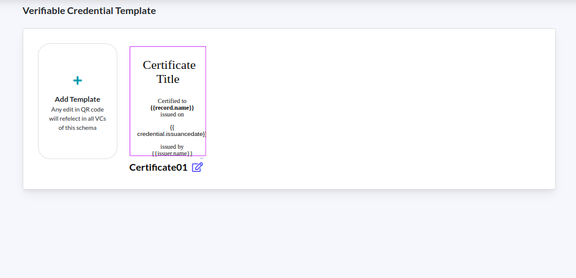
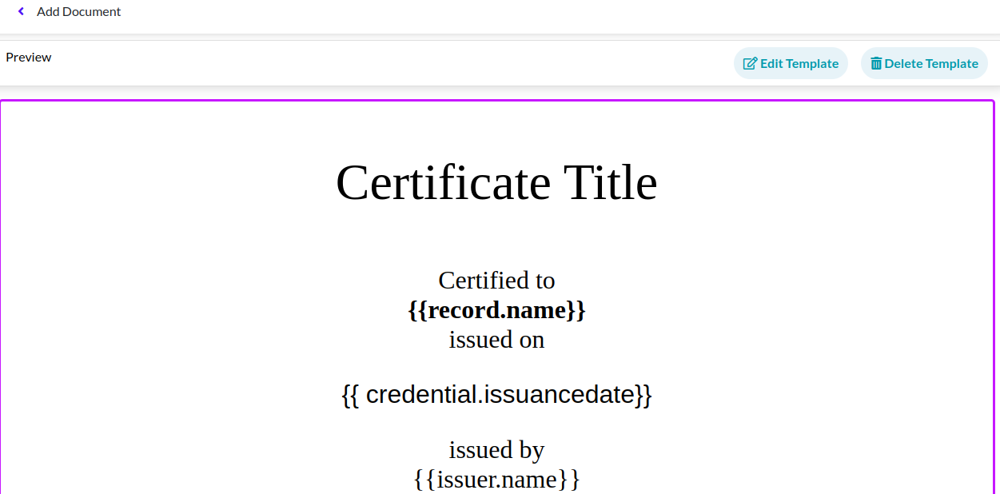
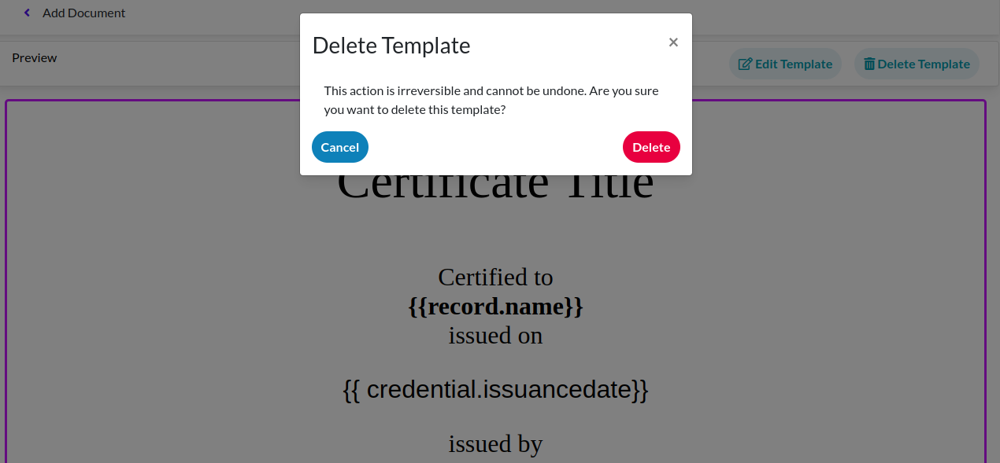

# VC Template

Create a VC template for the schema saved in previous step "Create Schema"

<figure><figcaption></figcaption></figure>

### Template

Once you have saved schema:

1. You can now add a verifiable credential template under each schema.
2. You can select existing template or [create custom template](https://docs.sunbirdrc.dev/developer-documentation/admin-portal/get-started/vc-template/custom-verifiable-credential-template)

<figure><figcaption></figcaption></figure>

### Template for Attestation Workflow

If you have created Attestation Workflow:

1. You can create a VC template for the attestation workflow.
2. For each attestation workflow, you can add a VC template.
3. You can select existing template or [create custom template](https://docs.sunbirdrc.dev/developer-documentation/admin-portal/get-started/vc-template/custom-verifiable-credential-template)

<figure><figcaption></figcaption></figure>

### Edit Template and Delete Template

**Editing a Template:**

If you need to modify an existing template, simply click on the template icon, you wish to edit. Within the template editor, you can add new fields, customise the appearance, and make any necessary changes.

<figure><figcaption>
Click on the icon, you will be able to edit the template
</figcaption></figure>

<figure><figcaption>
You can edit or delete the certificate template
</figcaption></figure>

**Deleting a Template:**

Please note that the action of deleting a template is irreversible. Exercise caution when choosing to delete a template, as all associated data will be permanently removed.

<figure><figcaption></figcaption></figure>
