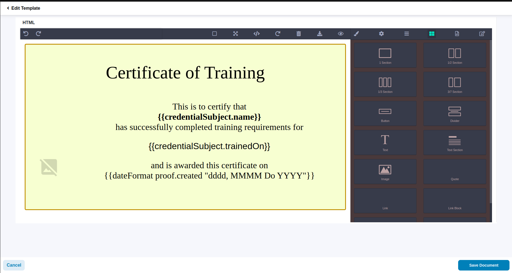
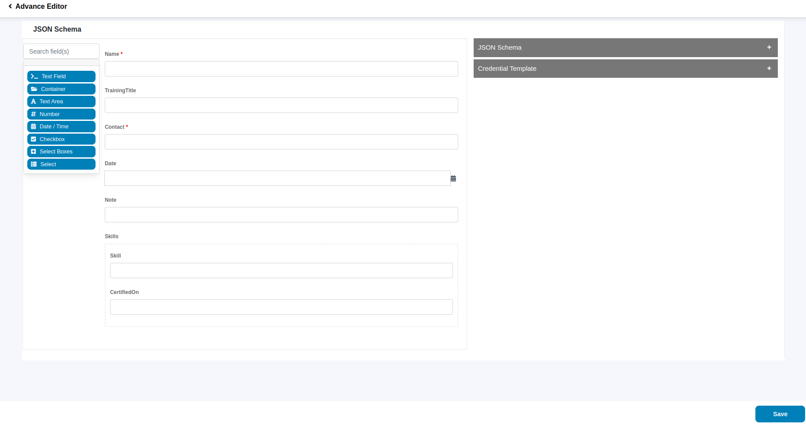

# Portal User Guide

**Certificate Issuance Portal**

[**https://sunbird-certificate-demo.xiv.in**](https://sunbird-certificate-demo.xiv.in/dashboard)

As the name suggests, Certificate Issuance Portal enables an Issuer to select a sample certificate and issue it to a person.

As an Issuer, Certificate Issuance consists mainly of two major steps.

1. Template Selection/ Template Generation
2. Certificate Issuance

Lets look at the first part :

**Template Selection & Generation**

* Login as a admin
* After logging in, you will see a button similar to the “Add New Document”
* This will take you to the screen where you can select some pre existing templates for your certificates.
* Currently there are 3 types of certificate templates created as part of the reference solution - Proof of Skill, Proof of Work and Proof of Disability.
* Whenever you select a particular template, you will be able to see the

preview on the right hand side.

.png>)

**Given above is the Proof of Work Certificate Template**

* The next step is to edit the certificate. Which takes you to the editor screen. Which will look something like this.

* On the editor screen you can edit the layout, add extra text, images, fonts, colors et.png>)

The above given editor provides a lot of functionalities to edit the certificate template. You can also export the html code of the generated certificate.

.png>)Advance Editor

//Validations

.png>)
