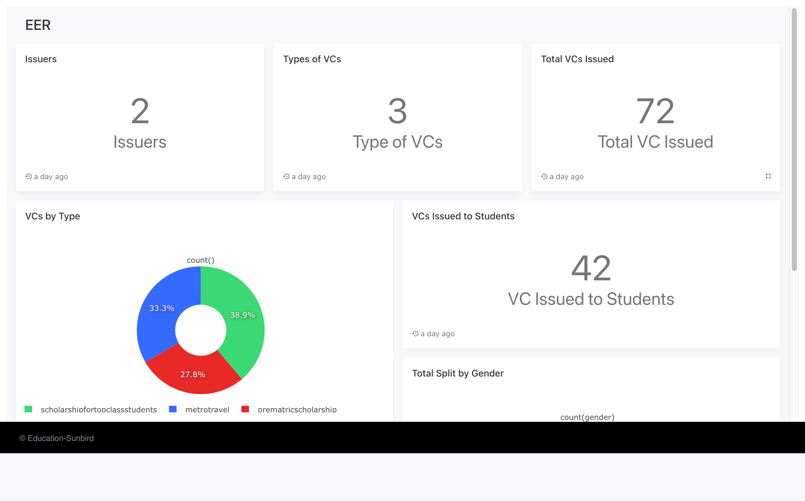

# Education Ecosystem

This reference solution has been designed to enable the needs of potential RC adopters - there are use cases being taken up which require issuers (who already have recipient data in some form - DB / Registry) to be able to issue VCs and end users to be able to see it via their DigiLocker. The various components of the reference solution can be used to enable such capabilities, irrespective of how the workflow specifics are tailored.

## Capabilities enabled

* Issuance of credentials (by Issuer admin) - for a single user/ in bulk mode
* Configure various templates for credentials via backend APIs
* Basic issuer dashboards on the issuance portal that keep track of the credentials issued
* The ability for Issuer to register on Digilocker (so as to allow the end user to pull their credentials from the issuer onto their Digilocker)
* Capability for the recipient to log in to the Issuer portal and view/ download/ share their credentials
* The ability for recipients to pull their credentials from the issuer onto their Digilocker account
* Data emit capability for RC + sample dashboards that leverage the data being emitted
* Generic SSO capability using MeriPehechaan that any adopter can choose to leverage if required: the capability to carry out SSO-based login + profile sharing (including Aadhaar token) using Digilocker - onto a portal

## Reference solution Components

## Issuance Portal

[https://docs.sunbirdrc.dev/reference-solutions/certificate-issuance](https://docs.sunbirdrc.dev/reference-solutions/certificate-issuance)

### Certificate signer

[https://docs.sunbirdrc.dev/learn/readme/high-level-architecture#certificate-signer](https://docs.sunbirdrc.dev/learn/readme/high-level-architecture#certificate-signer)

**Code -** [https://github.com/Sunbird-RC/sunbird-rc-core/tree/main/services/certificate-signer](https://github.com/Sunbird-RC/sunbird-rc-core/tree/main/services/certificate-signer)

* **Configs -** [https://docs.sunbirdrc.dev/developer-documentation/configuration#certificate-signer-service](https://docs.sunbirdrc.dev/developer-documentation/configuration#certificate-signer-service)

### Digilocker SSO

[https://docs.sunbirdrc.dev/use/sso-with-existing-systems/digilocker-meripehchaan-sso](https://docs.sunbirdrc.dev/use/sso-with-existing-systems/digilocker-meripehchaan-sso)

### Notification service

[https://docs.sunbirdrc.dev/learn/readme/high-level-architecture#notification-ms](https://docs.sunbirdrc.dev/learn/readme/high-level-architecture#notification-ms)

* **Code** - [https://github.com/Sunbird-RC/sunbird-rc-core/tree/main/services/notification-service](https://github.com/Sunbird-RC/sunbird-rc-core/tree/main/services/notification-service)
* **Configs** - [https://docs.sunbirdrc.dev/developer-documentation/configuration#notification-service](https://docs.sunbirdrc.dev/developer-documentation/configuration#notification-service)

### Keycloak

[https://docs.sunbirdrc.dev/learn/readme/high-level-architecture#certificate-api](https://docs.sunbirdrc.dev/learn/readme/high-level-architecture#certificate-api)&#x20;

* **Configs** - [https://www.keycloak.org/server/configuration](https://www.keycloak.org/server/configuration)

### Certificate/Presentation service&#x20;

https://docs.sunbirdrc.dev/learn/readme/high-level-architecture#certificate-api[^1]

* **Code** - [https://github.com/Sunbird-RC/sunbird-rc-core/tree/main/services/certificate-api](https://github.com/Sunbird-RC/sunbird-rc-core/tree/main/services/certificate-api)
* **Configs** - [https://docs.sunbirdrc.dev/developer-documentation/configuration#certificate-api-service](https://docs.sunbirdrc.dev/developer-documentation/configuration#certificate-api-service)

### Dashboard & Metrics

Sunbird RC allows for the 'emit' of events, which can be used to observe what is happening within the RC system. The system can be configured to emit events for actions such as ADD/ EDIT/ DELETE of credentials, or other actions carried out. Any adopter can configure the system to emit events that are required for the generation of metrics of interest. The followings are the links to the code and the configs for the RC dashboard

[https://docs.sunbirdrc.dev/developer-documentation/metrics](https://docs.sunbirdrc.dev/developer-documentation/metrics)

* **Config** - [https://docs.sunbirdrc.dev/developer-documentation/configuration#metrics-service](https://docs.sunbirdrc.dev/developer-documentation/configuration#metrics-service)&#x20;
* **Code** - [https://github.com/varadeth/sunbird-rc-core/tree/metric\_service/services/metrics](https://github.com/varadeth/sunbird-rc-core/tree/metric\_service/services/metrics)

Example dashboards

<figure><figcaption></figcaption></figure>

[^1]: 

