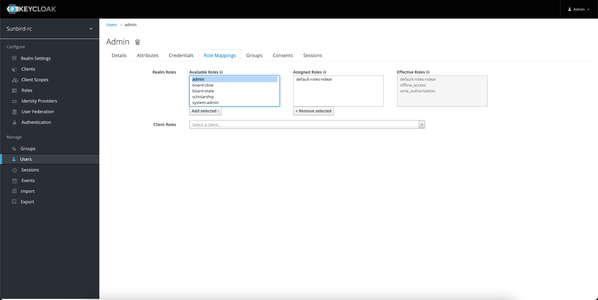

# Setup

### Backend Setup 

### Getting Code for Backend 

Clone the code from [https://github.com/Sunbird-RC/demo-education-registry/tree/federated\_edu\_registry](https://github.com/Sunbird-RC/demo-education-registry/tree/federated\_edu\_registry)

This will create a demo-education-registry folder in the current working directory. Go that folder

### Setting up a Registry Instance 

In the demo-education-folder, run the following command

docker-compose up -d

This will start all the required services. Once all the services are started, Go to the browser and open localhost:8080. This will open up the keycloak admin portal. Use username as admin and password as admin.

Once logged in, navigate to clients. Select admin-api. Go to credentials tab and click on regenerate secret. Copy this secret. Create a .env file in the project repo and add KEYCLOAK\_SECRET as a environment variable with the value of the secret in the following format\
KEYCLOAK\_SECRET=\<copied\_secret>

Recreate registry so that it reflects the keycloak secret. This can be done using docker-compose up -d –force-recreate –no-deps registry

If any service has not started you can recreate that service with the same command\
docker-compose up -d –force-recreate –no-deps \<service\_name>.

### Setting up Keycloak 

**Adding Roles**

Open localhost:8080 in the browser and navigate to roles in the left side pane. Click on Add Role.

.png>)

Create admin, scholarship, trial-scholarship roles

Create admin user in keycloak

.png>)

Assign admin role to this user

Now you can create issuers, create schema, issue VCs and view issued VCs\
You can follow the following [this](https://github.com/varadeth/demo-education-registry/blob/issue\_624\_backend\_eer\_docs/issuance.ipynb) jupyter notebook which has all the APIs

**Note**:-

1. Schemas for EER are present in the following location

[https://github.com/Sunbird-RC/demo-education-registry/tree/federated\_edu\_registry/sample\_schemas](https://github.com/Sunbird-RC/demo-education-registry/tree/federated\_edu\_registry/sample\_schemas)

1. When an issuer is created, the user is created in keycloak with the userId provided in the request body. Go to keycloak admin login page and assign him admin role. Also, the Issuer needs to have same role as in the roles in the schema\
   [https://github.com/Sunbird-RC/demo-education-registry/blob/federated\_edu\_registry/sample\_schemas/ScholarshipForTopClassStudents.json#L89](https://github.com/Sunbird-RC/demo-education-registry/blob/federated\_edu\_registry/sample\_schemas/ScholarshipForTopClassStudents.json#L89)

For eg, Scholarship Issuer has a userId of scholarship. So scholarship user in keycloak will need scholarship as a role to be assigned

1. When the VC is issued for the first time for a schema, a Group with schema name is created. This group is assigned to the actor’s user to which the credential was issued. To be able to view his credentials, he will need to have a role assigned to him. So assign the same role to the group created that is present [here](https://github.com/Sunbird-RC/demo-education-registry/blob/federated\_edu\_registry/sample\_schemas/ScholarshipForTopClassStudents.json#L89). Once the group is updated, all the actors to which the VC was issued from the particular schema will have the roles to get their respective credentials.

### Setting up Redash 

How to configure

Once all the services are up and running, run the following command\
docker-compose run --rm server create\_db

This command will run migrations for redash

Once this is successful, open the localhost:5678 in browser. The following screen should be displayed

You can create the admin user on this screen. Once you create the admin user, the admin user will be displayed. Here you can create a dashboard, queries etc. Create a dashboard and queries here

Once you click on the create query, if the data sources are not configured, it will ask you to configure

Add this details on the form to setup a connection with clickhouse

Now that you have connected to clickhouse, you can create queries. Once a query is successful, you can add your visualization in the below

Example query to access the stored data,

select entity.gender as gender from default.scholarshipfromtopclassstudents

Now you can go to dashboard and select edit. You can add widget there. Select the query that you want your visualization to run, choose the visualization. This is which you have created after successfully creating the query. Click on add to dashboard and the corresponding visualization will be visible

Add all the widgets and click on done Editing

### Frontend Setup 

* Navigate to this repository and create a fork & clone [https://github.com/Sunbird-RC/federated-education-registry](https://github.com/Sunbird-RC/federated-education-registry)
* Navigate to the federated-education-registry folder

* Make sure your node and npm versions are - node v16.13.1 (npm v8.1.2)

You can also manage these versions using [Node Version Manager](https://www.freecodecamp.org/news/node-version-manager-nvm-install-guide/)

