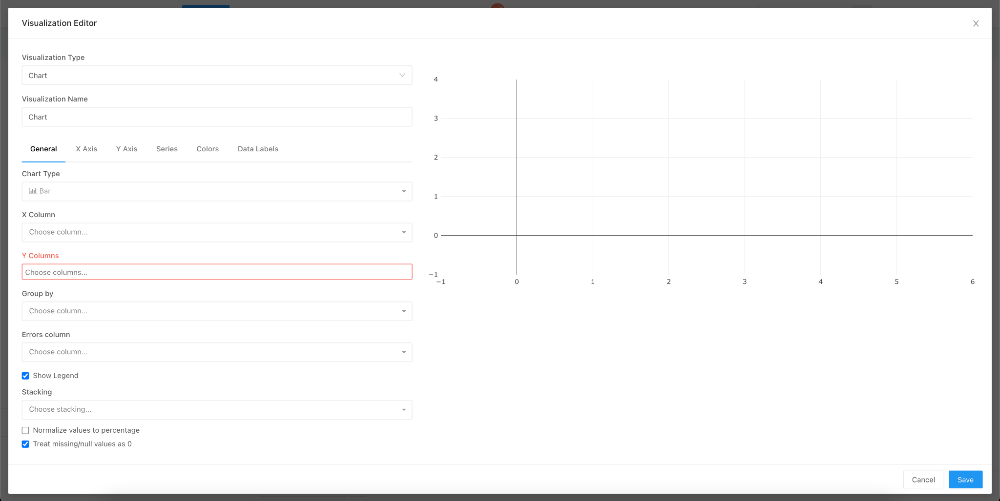

# Setup

### Knowledge Needed

A good understanding of docker, docker-compose & nginx

### Prerequisites

#### Docker

Installation instructions for Docker can be found [here](https://docs.docker.com/engine/install/).

Run `docker -v` in terminal to check if `docker` has been installed correctly:

```
$ docker -v
Docker version 20.10.9, build c2ea9bc90b
```

#### Docker Compose

Installation instructions can be found [here](https://docs.docker.com/compose/install/).

Run `docker compose version` in the terminal to check if `docker compose` has been installed correctly:

```
$ docker compose version
Docker Compose version 2.0.1
```

### Backend Setup <a href="#_btcqa01b80kx" id="_btcqa01b80kx"></a>

### Getting Code for Backend <a href="#_pjvmd0ibetjy" id="_pjvmd0ibetjy"></a>

Clone the repo

```bash
git clone https://github.com/Sunbird-RC/demo-education-registry.git
git checkout federated_edu_registry
```

This will create a demo-education-registry folder in the current working directory. Goto that folder

### Setting up a Registry Instance <a href="#_5l1lkhqaq9ey" id="_5l1lkhqaq9ey"></a>

In the demo-education-folder, run the following command

```bash
docker compose up -d
```

This will start all the required services. Once all the services are started, Go to the browser and open [http://localhost:8080/auth/](http://localhost:8080/auth/). This will open up the keycloak admin portal. Use username as `admin` and password as `admin`.

Once logged in, navigate to `clients`. Select `admin-api`. Go to `credentials` tab and click on regenerate secret. Copy this secret. Create a .env file in the project repo and add `KEYCLOAK_SECRET` it as an environment variable with the value of the secret in the following format\
`KEYCLOAK_SECRET=<copied_secret>`


Recreate the registry so that it reflects the keycloak secret. This can be done using&#x20;

```bash
docker compose up -d --force-recreate --no-deps registry
```

If any service has not started you can recreate that service with the same command

```bash
docker compose up -d --force-recreate --no-deps <service_name>
```

Check if all the services are started

```bash
docker compose ps
```

```bash
NAME                                                   IMAGE                                                  COMMAND                  SERVICE                      CREATED              STATUS                                 PORTS
demo-education-registry-adhoc_worker-1                 redash/redash:8.0.0.b32245                             "/app/bin/docker-ent…"   adhoc_worker                 About a minute ago   Up About a minute                      5000/tcp
demo-education-registry-certificate-api-1              dockerhub/sunbird-rc-certificate-api                   "docker-entrypoint.s…"   certificate-api              17 hours ago         Up 17 hours (healthy)                  0.0.0.0:8078->8078/tcp, :::8078->8078/tcp
demo-education-registry-certificate-signer-1           dockerhub/sunbird-rc-certificate-signer                "docker-entrypoint.s…"   certificate-signer           17 hours ago         Up 17 hours (healthy)                  0.0.0.0:8079->8079/tcp, :::8079->8079/tcp
demo-education-registry-claim-ms-1                     dockerhub/sunbird-rc-claim-ms:v0.0.13                  "java -jar /app.jar"     claim-ms                     About a minute ago   Up About a minute                      0.0.0.0:8082->8082/tcp, :::8082->8082/tcp
demo-education-registry-clickhouse-1                   clickhouse/clickhouse-server:head-alpine               "/entrypoint.sh"         clickhouse                   17 hours ago         Up 17 hours (healthy)                  8123/tcp, 9009/tcp, 0.0.0.0:9004->9000/tcp, :::9004->9000/tcp
demo-education-registry-db-1                           postgres                                               "docker-entrypoint.s…"   db                           About a minute ago   Up About a minute                      0.0.0.0:5432->5432/tcp, :::5432->5432/tcp
demo-education-registry-digilocker_certificate_api-1   sunbirdrc/sunbird-rc-digilocker-certificate-api        "/go/main"               digilocker_certificate_api   About a minute ago   Up About a minute                      8086/tcp, 0.0.0.0:8087->8087/tcp, :::8087->8087/tcp
demo-education-registry-es-1                           docker.elastic.co/elasticsearch/elasticsearch:7.10.1   "/tini -- /usr/local…"   es                           17 hours ago         Up 17 hours (healthy)                  0.0.0.0:9200->9200/tcp, :::9200->9200/tcp, 0.0.0.0:9300->9300/tcp, :::9300->9300/tcp
demo-education-registry-file-storage-1                 quay.io/minio/minio                                    "/usr/bin/docker-ent…"   file-storage                 17 hours ago         Up 17 hours (healthy)                  0.0.0.0:9003->9000/tcp, :::9003->9000/tcp, 0.0.0.0:9002->9001/tcp, :::9002->9001/tcp
demo-education-registry-kafka-1                        confluentinc/cp-kafka:latest                           "/etc/confluent/dock…"   kafka                        17 hours ago         Up 17 hours (unhealthy)                0.0.0.0:9092->9092/tcp, :::9092->9092/tcp
demo-education-registry-keycloak-1                     dockerhub/sunbird-rc-keycloak:nonce                    "/opt/jboss/tools/do…"   keycloak                     About a minute ago   Up About a minute (health: starting)   0.0.0.0:8080->8080/tcp, :::8080->8080/tcp, 0.0.0.0:9990->9990/tcp, :::9990->9990/tcp, 8443/tcp
demo-education-registry-metrics-1                      varadeth/sunbird-rc-metrics:metrics                    "/app/metrics/metric…"   metrics                      17 hours ago         Up 2 minutes                           0.0.0.0:8070->8070/tcp, :::8070->8070/tcp
demo-education-registry-nginx-1                        dockerhub/sunbird-rc-nginx                             "/docker-entrypoint.…"   nginx                        About a minute ago   Restarting (1) 26 seconds ago
demo-education-registry-redis-1                        redis                                                  "docker-entrypoint.s…"   redis                        17 hours ago         Up 17 hours                            0.0.0.0:6379->6379/tcp, :::6379->6379/tcp
demo-education-registry-registry-1                     varadeth/sunbird-rc-core:metrics                       "java -Xms1024m -Xmx…"   registry                     About a minute ago   Up About a minute                      0.0.0.0:8081->8081/tcp, :::8081->8081/tcp
demo-education-registry-scheduled_worker-1             redash/redash:8.0.0.b32245                             "/app/bin/docker-ent…"   scheduled_worker             About a minute ago   Up About a minute                      5000/tcp
demo-education-registry-scheduler-1                    redash/redash:8.0.0.b32245                             "/app/bin/docker-ent…"   scheduler                    About a minute ago   Up About a minute                      5000/tcp
demo-education-registry-server-1                       redash/redash:8.0.0.b32245                             "/app/bin/docker-ent…"   server                       About a minute ago   Up About a minute                      0.0.0.0:5678->5000/tcp, :::5678->5000/tcp
demo-education-registry-zookeeper-1                    confluentinc/cp-zookeeper:latest                       "/etc/confluent/dock…"   zookeeper                    17 hours ago         Up 17 hours                            2888/tcp, 0.0.0.0:2181->2181/tcp, :::2181->2181/tcp, 3888/tcp
```

### Setting up Keycloak <a href="#_9kf7tx8j3sxx" id="_9kf7tx8j3sxx"></a>

**Adding Roles**

Open [http://localhost:8080/auth/](http://localhost:8080/auth/) in the browser and navigate to roles in the left side pane. Click on Add Role.

.png>)

Create `admin`, `scholarship`, `trial-scholarship` roles


Create `admin` user in keycloak


Update the credential for the `admin` user. `Ex: abcd@123`

.png>)

Assign `admin` role to this user


Now you can use the `admin` user to create issuers, create schemas, issue VCs and view issued VCs\
You can follow the following [jupyter notebook](https://github.com/varadeth/demo-education-registry/blob/issue\_624\_backend\_eer\_docs/issuance.ipynb) which has all the APIs.

**Note**:-

* Schemas for EER are present in the following location



#### Assign \`admin\` role to the issuer

* An issuer will require `admin` role to create schemas in the registry.
* Goto keycloak admin console, http://localhost:8080/auth/
* Goto `Groups` and double-click on `Issuer`
* If `Issuer` group is not found, then you need to create an issuer first. The APIs to create the issuer is documented in the above jupyter notebook.
* Goto `Role Mappings` and select `admin` from `Available Roles` and click `Add Selected`

<figure><figcaption></figcaption></figure>

The issuer will require the same roles that are configured in the schema configuration to issue VCs for that schema. In the below sample schema, `ScholarshipForTopClassStudents` it requires a user to have `scholarship` role. Only if the issuer contains that role then he will be able to issue VC. Similar to the above steps, you can assign the `scholarship` roles to the issuer to get access.&#x20;



### Setting up Redash <a href="#_cf0y99rd0e19" id="_cf0y99rd0e19"></a>

How to configure

Once all the services are up and running, run the following command

```bash
dockerompose run --rm server create_db
```

This command will run migrations for redash

Once this is successful, open the [http://localhost:5678](http://localhost:5678) in the browser. The following screen should be displayed


You can create the admin user on this screen. Once you create the admin user, the admin user will be displayed. Here you can create a dashboard, queries etc. Create a dashboard and queries here


#### Connect to the data source

* On the home page click on `Connect a Data Source`
* Search for `Clickhouse`
* Add these details on the form to set up a connection with Clickhouse


Now that you have connected to Clickhouse, you can create queries. Once a query is successful, you can add your visualization in the below

For example, query to access the stored data,

select entity.gender as gender from default.scholarshipfromtopclassstudents





Now you can go to dashboard and select edit. You can add widget there. Select the query that you want your visualization to run, choose the visualization. This is which you have created after successfully creating the query. Click on add to dashboard and the corresponding visualization will be visible


Add all the widgets and click on done Editing

### Frontend Setup <a href="#_lcjuuta90ki" id="_lcjuuta90ki"></a>

* Navigate to this repository and create a fork & clone [https://github.com/Sunbird-RC/federated-education-registry](https://github.com/Sunbird-RC/federated-education-registry)
* Navigate to the federated-education-registry folder

.png>)

* Make sure your node and npm versions are - node v16.13.1 (npm v8.1.2)

You can also manage these versions using [Node Version Manager](https://www.freecodecamp.org/news/node-version-manager-nvm-install-guide/)

.png>)
