# User Guide

## Login

<figure><figcaption></figcaption></figure>

* Enter mobile number
* Click on “Continue” button

<figure><figcaption></figcaption></figure>

* Enter the 4 digit OTP received on entered mobile number( Use 1234 for demo portal)
* Click on “Confirm” button

## Upload Document

<figure><figcaption></figcaption></figure>

* Click on “Upload Document” option (Add files (JPEG, PNG, JPG, PDF) from your device)

<figure><figcaption></figcaption></figure>

* Enter name of the document

<figure>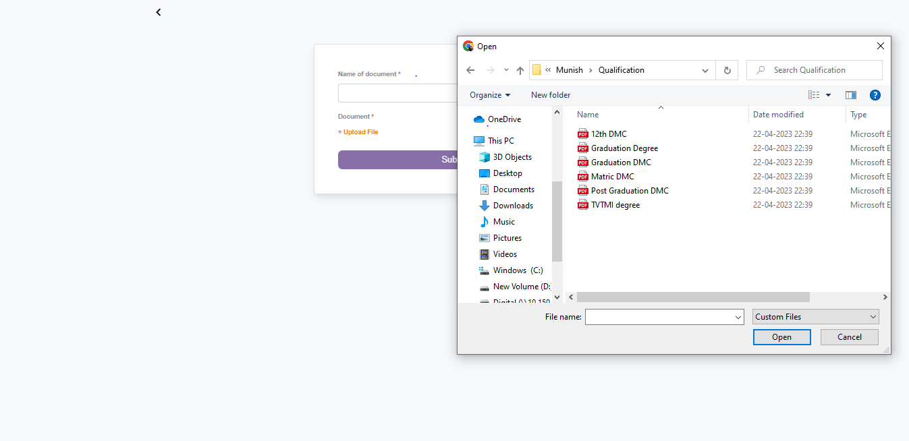<figcaption></figcaption></figure>

<figure>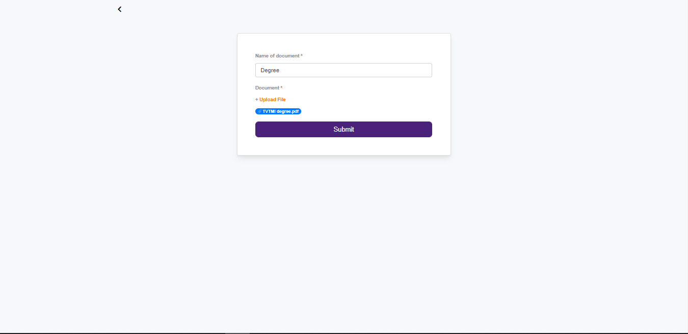<figcaption></figcaption></figure>

* Click on “Upload File” option
* This will open a file dialog box, select the template file to upload
* Click on “Submit” butto

<figure>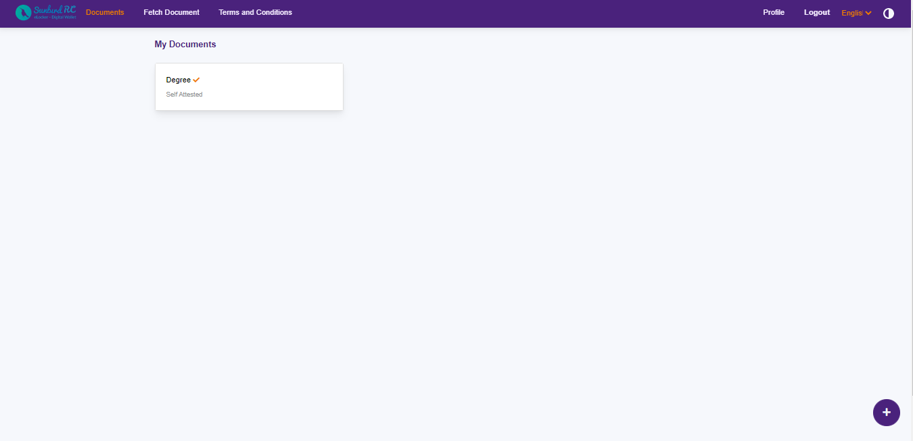<figcaption></figcaption></figure>

* Uploaded document will be marked as self attested and can be seen in the available list view of the document

## Scan Document

<figure>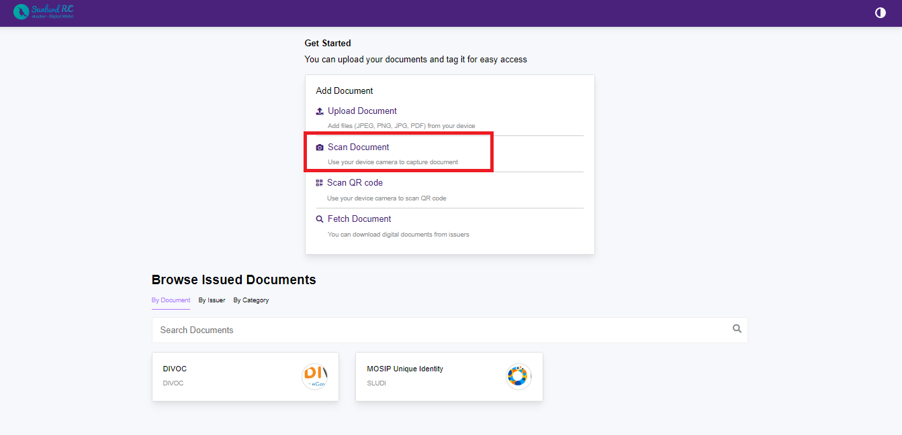<figcaption></figcaption></figure>

* Click on “Scan Document” option

<figure>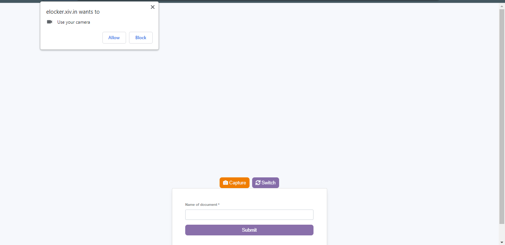<figcaption></figcaption></figure>

* The System will prompt to allow access to  your device camera
* Click “Allow” to proceed
* Position your camera to scan the document and click on the Capture button

<figure>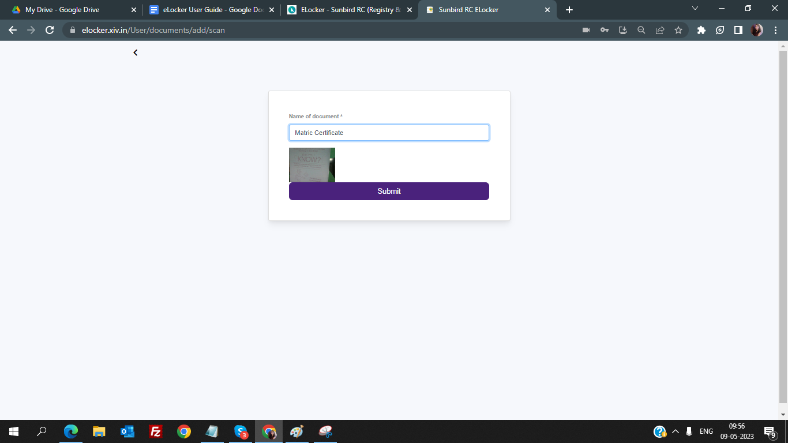<figcaption></figcaption></figure>

* Once the document has been captured,enter the name of the document in the designated field
* Click on the Submit button

<figure>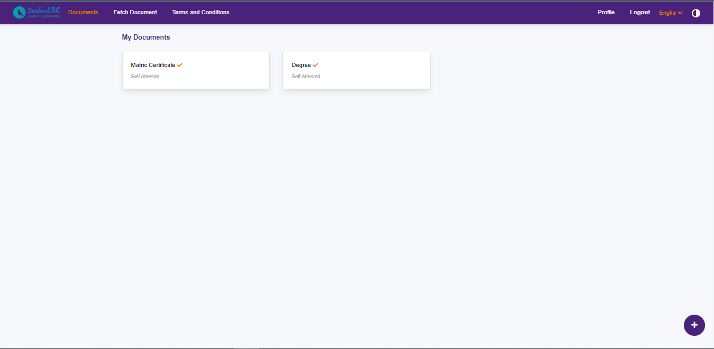<figcaption></figcaption></figure>

The scanned document will now be marked as self attested and can be seen in the available list view of the document

## Scan QR Code?? - Functionality Not working

## Fetch document

<figure>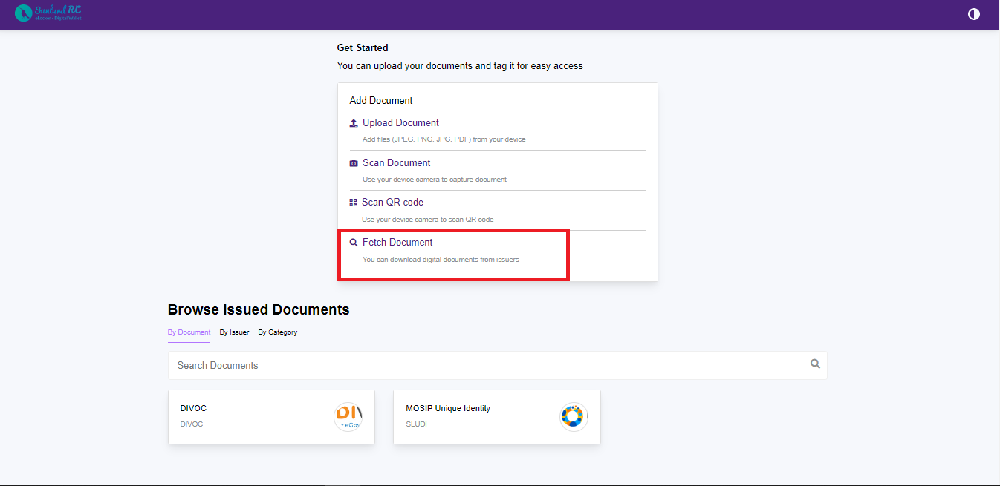<figcaption></figcaption></figure>

* Click on Fetch Document

<figure>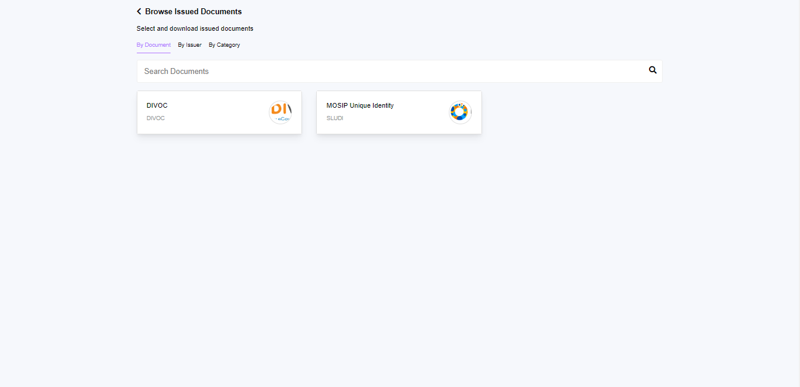<figcaption></figcaption></figure>

* Three options are available to search the documents
  * By Document
  * By Issuer
  * By Category
* Select the option that is appropriate for your document search

<figure>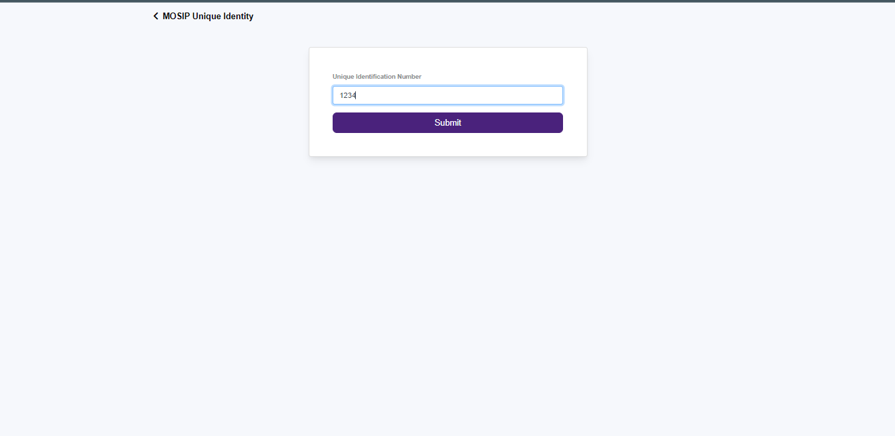<figcaption></figcaption></figure>

* Enter the Unique Identification number in case of MOSIP and Pre Enrolment number for DIVOC
* Click on Submit button

<figure>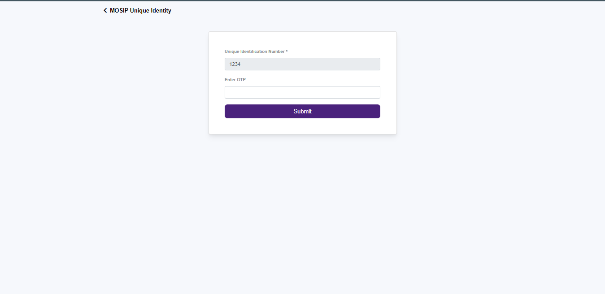<figcaption></figcaption></figure>

* Enter the OTP(Use 1234 for the demo portal)

<figure>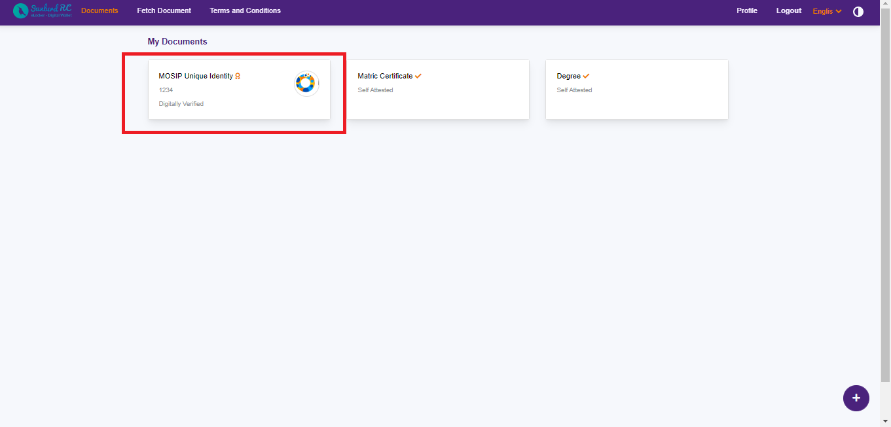<figcaption></figcaption></figure>

* Document gets fetched in the list view as digitally verified documents

\
