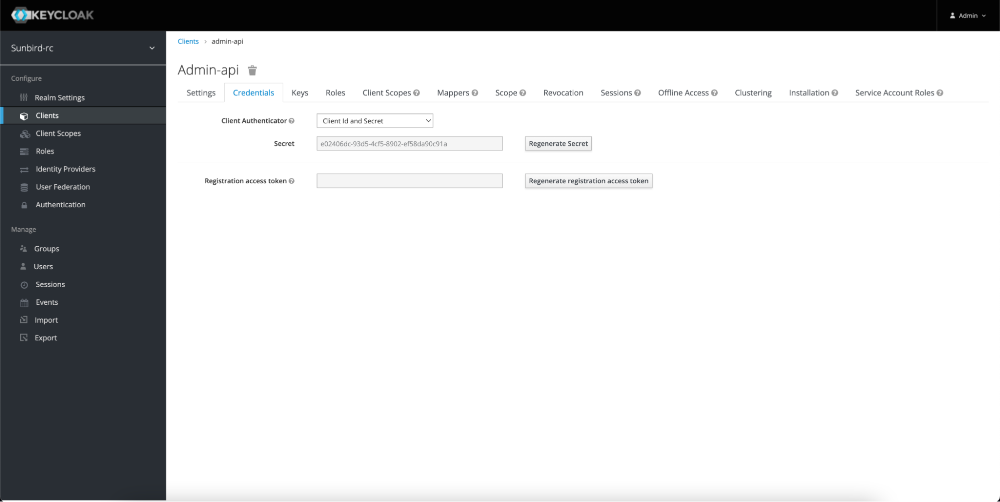

# Backend Setup

### Backend Setup

#### Getting Code for Backend

Visit the following github url and clone the code. Navigate to demo-donor-registry folder

```
git clone https://github.com/Sunbird-RC/demo-donor-registry
```

#### Setting up a Registry Instance

Navigate into demo-donor-registry folder and run the following command

```
docker-compose up -d
```

This will start all the required services.

#### Setting up Keycloak

Once all the services are started, Go to the browser and open localhost:8080. This will open up the keycloak admin portal. Use username as admin and password as admin.

Once logged in, navigate to clients. Select admin-api. Go to the credentials tab and click on regenerate secret. Copy this secret. Create a .env file in the project repo and add KEYCLOAK\_SECRET as a environment variable with the value of the secret in the following format

KEYCLOAK\_SECRET=\<copied\_secret>

<figure><figcaption></figcaption></figure>

Again navigate to the keycloak homepage. Navigate to the Clients tab in the left subsection. Click on the Create button available on the right side of the screen. Enter client ID as donor-service. Client Protocol as openid-connect and click on save button.

This will create a new client named donor-service in keycloak. This will be used to communicate with the registry from the donor-service microservice.

Once the client is created, you will see the donor-service clients configurations. Change the access type to confidential and enable the toggle button for Service Accounts Enabled. Add appropriate redirect URL where you have hosted your UI

After the client configurations are saved, in the top tabs section you will see a credentials tab. Open that and copy the client secret present in that input box and add a environment variable in .env file as follows

```
SERVICE_ACCOUNT_CLIENT_SECRET=<copied_secret>
```

Recreate registry so that it reflects the keycloak secrets. This can be done using

```
docker-compose up -d –force-recreate –no-deps registry donor-service
```

**Keycloak Configurations :-**

If you want to enable sending sms with OTP, you will need to add following configurations

| Environment Variable         | Description                                                                                           |
| ---------------------------- | ----------------------------------------------------------------------------------------------------- |
| MOCK\_OTP                    | Boolean which indicates whether actual message needs to be sent or dummy OTP of 1234 needs to be used |
| MESSAGE\_TEMPLATE            | OTP Message template                                                                                  |
| NOTIFICATION\_SERVICE\_URL   | Notification Service url                                                                              |
| REGISTER\_URL                | Donor registry UI Hosted URL                                                                          |
| INVALID\_USERNAME            | Message to be sent to user if he is using incorrect Username or username is Not registered            |
| VALID\_OTP                   | Message for user to enter valid otp                                                                   |
| INVALID\_REGISTRATION        | Message to be displayed to user for Abha number or mobile number not registered                       |
| OTP\_MAX\_RETRY\_LIMIT       | Number of attempts user can enter his OTP                                                             |
| MAX\_RETRIES\_LIMIT\_MESSAGE | Message to be displayed to user after user fails to login in maximum number of login attempts         |
| MAX\_RESEND\_TRIES           | Number of attempts for user to get OTP                                                                |
| FORGOT\_ABHA                 | Url which redirects user to recover his Abha number                                                   |

Restart keycloak after changing any of the above ENV

```
docker-compose up -d –force-recreate –no-deps keycloak
```

If any service has not started you can recreate that service with the same command

```
docker-compose up -d –force-recreate –no-deps <service_name>

```

### Other Services

1. **Donor Service**

\
You need to have access to sandbox environment of [https://healthid.abdm.gov.in](https://healthid.abdm.gov.in) and you should have access to abdm APIs from this.

Sandbox environment will have the URL of [https://healthidsbx.abdm.gov.in/](https://healthidsbx.abdm.gov.in/).

Following are the configurations needed for donor-service

Code -> [https://github.com/Sunbird-RC/demo-donor-registry/tree/main/backend/donor-service](https://github.com/Sunbird-RC/demo-donor-registry/tree/main/backend/donor-service)\
Configs ->

| Environment Variable             | Description                                                                                                                                         |
| -------------------------------- | --------------------------------------------------------------------------------------------------------------------------------------------------- |
| ABHA\_CLIENT\_URL                | API url to retrieve token to be used for abdm apis to create or access abha kyc information                                                         |
| CLIENT\_ID                       | Client ID for abha kyc apis                                                                                                                         |
| CLIENT\_SECRET                   | Client secret for abha kyc apis                                                                                                                     |
| REDIS\_URL                       | Url to access redis                                                                                                                                 |
| BASE\_URL                        | ABHA Kyc Api base url                                                                                                                               |
| SERVICE\_ACCOUNT\_CLIENT\_SECRET | Client secret for donor-service client id in keycloak                                                                                               |
| KEYCLOAK\_URL                    | Url to access keycloak                                                                                                                              |
| REGISTRY\_URL                    | Url to access Registry                                                                                                                              |
| EXPIRE\_PROFILE                  | To Store the transactionId of esign in redis with Expiry. EXPIRE\_PROFILE is a integer with this expiry time                                        |
| ESIGN\_ESP\_URL                  | Esign Url                                                                                                                                           |
| ESIGN\_ESP\_PDF\_URL             | Url to fetch the signed document                                                                                                                    |
| ESIGN\_FORM\_SIGN\_URL           | Url which opens up for esign’ing the document                                                                                                       |
| NUMBER\_OF\_DIGITS               | Number of digits which you want to use to create unique NOTTO-ID.                                                                                   |
| UNIQUE\_ABHA\_ENABLED            | Boolean value if true, indicates you want to have one pledge per abha number                                                                        |
| NOTIFICATION\_SERVICE\_URL       | Notification url to be used to send out sms/emails                                                                                                  |
| LOGIN\_LINK                      | Login link to donor registry                                                                                                                        |
| INVITE\_TEMPLATE\_ID             | Template ID for Sms to be sent out to donor when the donor has successfully pledged                                                                 |
| NOTIFY\_TEMPLATE\_ID             | Template ID for Sms to be sent out to the contact mentioned in the notification Details so that he knows the donor and who has successfully pledged |
| UPDATE\_TEMPLATE\_ID             | Template ID for Sms to be sent out to donor when the donor has successfully edited the pledged                                                      |
| UNPLEDGE\_TEMPLATE\_ID           | Template ID for Sms to be sent out to donor when the donor has successfully unpledged                                                               |
| LOG\_LEVEL                       | Log level like info which will only print that logs                                                                                                 |

2.  **Certificate signer ->** [certificate-signer](../../../learn/tech-overview/high-level-architecture.md#certificate-signer)

    Code ->

    [https://github.com/Sunbird-RC/sunbird-rc-core/tree/main/services/certificate-signer](https://github.com/Sunbird-RC/sunbird-rc-core/tree/main/services/certificate-signer)

    Configs ->

    [https://docs.sunbirdrc.dev/developer-documentation/configuration#certificate-signer-service](https://docs.sunbirdrc.dev/developer-documentation/configuration#certificate-signer-service)

    Signing Keys

    You can place your signing keys in the document in the path

    demo-donor-registry/imports/config.json. Based on the issuer’s name, the key will be picked in order to create signed credentials. Sample for the keys is as follows for scholarship as a issuer
3.  **Notification service ->** [notification-ms](../../../learn/tech-overview/high-level-architecture.md#notification-ms)

    Technical ->

    Code ->

    [https://github.com/Sunbird-RC/sunbird-rc-core/tree/main/services/notification-service](https://github.com/Sunbird-RC/sunbird-rc-core/tree/main/services/notification-service)

    Configs ->

    [https://docs.sunbirdrc.dev/developer-documentation/configuration#notification-service](https://docs.sunbirdrc.dev/developer-documentation/configuration#notification-service)
4.  **Certificate/Presentation service ->** [certificate-api](../../../learn/tech-overview/high-level-architecture.md#certificate-api)

    Technical ->

    Code ->

    [https://github.com/Sunbird-RC/sunbird-rc-core/tree/main/services/certificate-api](https://github.com/Sunbird-RC/sunbird-rc-core/tree/main/services/certificate-api)

    Configs ->

    [https://docs.sunbirdrc.dev/developer-documentation/configuration#certificate-api-service](https://docs.sunbirdrc.dev/developer-documentation/configuration#certificate-api-service)
5.  **Certificate PDF Service**

    This service will take a template as a pdf and return a pdf with the actual certificate.

    Technical ->

    Code -> [https://github.com/Sunbird-RC/demo-donor-registry/tree/main/backend/certificate-pdf-service](https://github.com/Sunbird-RC/demo-donor-registry/tree/main/backend/certificate-pdf-service)
6.  **Notification Service ->**

    Used to send notifications

    Technical ->

    Code -> [https://github.com/Sunbird-RC/demo-donor-registry/tree/main/backend/notification-service](https://github.com/Sunbird-RC/demo-donor-registry/tree/main/backend/notification-service)\
    Configs ->

|                  |                                    |
| ---------------- | ---------------------------------- |
| SMPP\_ENTITY\_ID | Entity ID used to send out SMS     |
| SMPP\_PASSWORD   | SMS API password                   |
| SMPP\_SOURCE     | Source with which SMS will be sent |
| SMPP\_USER\_NAME | SMS API Username                   |
| SMS\_URL         | SMS URL of provider                |

7. **Claims ->** [Claim Service](../../../learn/tech-overview/high-level-architecture.md#claim-ms)
8. **Elastic Search ->** [Elastic Search](../../../learn/tech-overview/high-level-architecture.md#elastic-search)
9. **MinIO ->** [File storage](../../../learn/tech-overview/high-level-architecture.md#file-storage-minio)
10. **Verification Service**

Verification of credential refers to verifying the authenticity of the credential that the actor possesses. When a credential is issued, it is signed via issuers private key. This can then be verified by an issuer's public key which is made available to whoever is trying to verify the credentials. This is taken care by certificate-signer service. Certificate signer service provides an API which takes signed Credentials as input. From the issuer name, it fetches the public key of the issuer. Using this public key, the verifier verifies the authenticity of the credential.

Refer to [this](../../../api-reference/other-apis/verify-api.md) API
