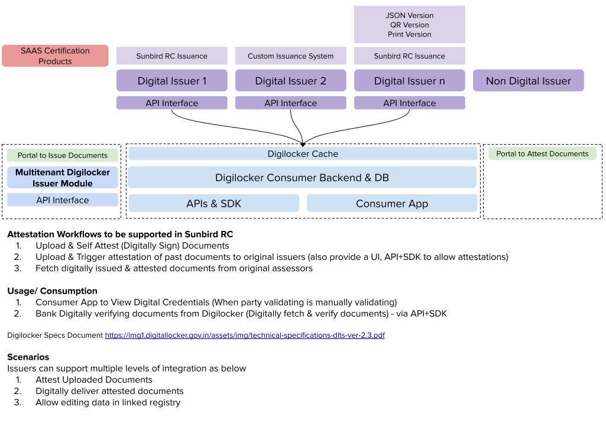

# ELocker

##  (1).png>)

## eLocker (Digital Locker)

Sunbird eLocker is a reference solution built on Sunbird RC to help countries quickly establish their digital locker platform. This reference solution is provided as a basic starting point for building a digital eLocker platform to store and manage credentials of users.

**High Level Diagram (WIP)**

### Subjects

1. Credential Issuer
2. eLocker
3. End User

### **User Personas**

1.  **Consumer:**

    I would like to have easy access of my documents, so that I can use it whenever required.
2.  \*\*Issuer: \*\*

    I would like to manage the issuance of certificate at one place.
3.  \*\*Accepting Party/3rd Party: \*\*

    (WIP)I would like to access documents of my customer easily, so that I can review and process the next steps of my customer’s claim…

### **User Flows (Issuer)**

* Registration/Onboarding
* Issuance Flow
  1.  Type 1 (Upload data)

      Issuers who are not digital can get onboarded fast - by using upload functionality
  2.  Type 2 (Issuance system)

      Issuer uses Sunbird RC’s issuer system to issue certificate
  3.  Type 3 (API endpoint)

      Connecting to existing system

### **User Flows (Accepting/3rd Party)**

## Source Code

The source code to install this example can be found at [https://github.com/Sunbird-RC/demo-elocker](https://github.com/Sunbird-RC/demo-elocker)

## Project Link

[https://github.com/orgs/Sunbird-RC/projects/2](https://github.com/orgs/Sunbird-RC/projects/2)

## Demo/Sandbox site link

Usecase implementation can be found here at [https://elocker.xiv.in/](https://elocker.xiv.in/)
